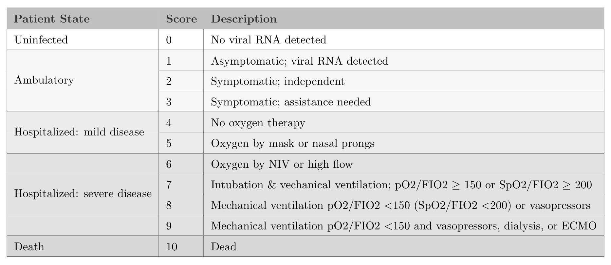

If it's true that most readers of an academic journal article only read the abstract and look at the figures and tables, while skimming the rest, then it is particularly important that you can tell the story (or at least suggest it) with a well conceived graphic or two. My collaborators and I are in the process of figuring out how we'd like to represent our findings in a paper that has yet to be written, and I thought I'd document just a few of the options that I've come up with so far, and share the code.

As I mentioned, the motivation for this code I am sharing here is a data set we don't have yet. The study is a large multi-site trial called [CONTAIN](https://bit.ly/3b7aZCr){target="_blank"}, which is evaluating the effectiveness of using convalescent plasma (CP) from patients who already had COVID-19 to treat newly hospitalized patients with COVID-19. The primary outcome is a World Health Organization (WHO) score that ranges from 0 to 10, where 0 is healthy and virus-free and 10 is death:



The goal of study is to show that patients who receive CP will be more likely to have lower WHO scores 14 days after starting treatment compared to those who receive a saline solution placebo.

The analysis will use a cumulative proportional odds model, which I have written about before (see [here](https://www.rdatagen.net/post/a-hidden-process-part-2-of-2/){target="_blank"}, for example). I won't get into the model here (I wrote about the model in the context of a related project [here](https://www.rdatagen.net/post/2021-01-19-should-we-continue-recruiting-patients-an-application-of-bayesian-predictive-probabilities/){target="_blank"}), but want to show a few options for presenting the data visually in a way that indicates whether or not the treatment had an effect. Often, I will not show the `ggplot` code, but that is really the point here so I am showing everything.

### The data

Since we are in the middle of the RCT, I don't have access to any actual data. Simulation will work just fine here. The data generation process is quite simple - I generate 1000 individuals, assign half to treatment and half to control. The baseline probabilities for the distribution of outcomes in the control arm are specified by providing the 11 probabilities for each category. The probabilities for the treatment arm are based on an assumed log cumulative odds ratio of -0.6 (which translates to a cumulative odds ratio of 0.55). The odds we are talking about are

$$
Odds = \frac{P(WHO \ge y)}{P(WHO < y)}, \ \ y \in \{2,\dots,10\},
$$
so it is clear that lower odds is preferred.

```{r}
library(simstudy)
library(data.table)
library(ggplot2)

def <- defDataAdd(varname = "z", formula = "rx * -0.6", dist = "nonrandom")

set.seed(39821)

dd <- genData(1000)
dd <- trtAssign(dd, grpName = "rx")
dd <- addColumns(def, dd)

dd <- genOrdCat(
  dd, 
  adjVar = "z", 
  baseprobs = c(0.06, 0.06, 0.10, 0.10, 0.10, 0.13, 0.13, 0.10, 0.10, 0.06, 0.06),
  catVar = "WHO"
)
```

### Summarizing the data

In the plots that follow, I will be using summary data: proportions and cumulative proportions of patients that fall into each category. I will calculate those manually from the categorical counts:

```{r}
dsum <- dd[, .(N = sum(.N)), keyby = .(rx, WHO)]
dsum[, rx := factor(rx, labels = c("control", "treatment"))]
dsum
```

I will also need the total number of patients in each arm so that I can provide informative labels:

```{r}
dnames <- dsum[, sum(N), keyby = rx]
dnames[, legend_label := paste0(rx, " (n = ", V1, ")")]
dnames[, axis_label := paste0(rx, "\n(n = ", V1, ")")]
dnames
```

### Proportions by arm

The first plot is quite straightforward, showing the proportion of each arm that falls in each category. In this case, we see right away, that the treatment arm has more patients in the lower categories. I'd say the downside to this is that it is not particularly elegant, but it is easy to read off the percentages:

```{r, fig.height = 3.5, fig.width = 5}
dsum[, prop := N/sum(N), keyby = rx]
dsum[, legend_label := factor(rx, labels = dnames[, legend_label])]

ggplot(data = dsum, aes(x = WHO, y = prop)) +
  geom_line(aes(group = legend_label, color = legend_label), size = 1) +
  geom_point(aes(color = legend_label), size = 2) +
  ylim(0, 0.2) +
  theme(panel.grid = element_blank(),
        legend.title = element_blank(),
        legend.position = c(.8, .88),
        legend.background = element_rect(fill = "grey92"),
        legend.key = element_rect(fill = "grey92")) +
  scale_color_manual(values = c("#798E87", "#C27D38"),
                     guide = guide_legend(revers = TRUE)) +
  scale_x_discrete(labels = c("virus-free", 1:9, "died")) +
  ylab("proportion") +
  xlab("WHO score")
```

### Cumulative proportion by arm

A more elegant version of the proportional line plot might be the same idea but with cumulative probabilities or proportions. We again see that the treatment is having the desired effect, as the cumulative proportion is higher at the low end of the scale. I actually like this one, but it may be hard for folks to interpret, particularly if they haven't worked with ordinal data extensively.

```{r, fig.height = 3.5, fig.width = 5}
dsum[, cumprop := cumsum(prop), keyby = rx]

ggplot(data = dsum, aes(x = WHO, y = cumprop)) +
  geom_line(aes(group = legend_label, color = legend_label), size = 1) +
  geom_point(aes(color = legend_label), size = 2) +
  scale_x_discrete(labels = c("virus-free", 1:9, "died")) +
  ylim(0, 1) +
  theme(panel.grid = element_blank(),
        legend.title = element_blank(),
        legend.position = c(.75, .2),
        legend.background = element_rect(fill = "grey92"),
        legend.key = element_rect(fill = "grey92")) +
  scale_color_manual(values = c("#798E87", "#C27D38"),
                     guide = guide_legend(revers = TRUE)) +
  ylab("cumulative proportion") +
  xlab("WHO score")
```

### Distribution of outcome using stacked bars

The next one has a lot of information on it, and looks pretty nice. It shows the distribution using the stacked bars. I think with a lot of categories, it might not be completely obvious that treatment appears effective. With additional use of colors, we might be able to overcome this. But I've reserved that for the final plot.

```{r, fig.height = 7, fig.width = 5}
cc <- scales::seq_gradient_pal("white", "#267efa")(seq(0,1,length.out=11))
dsum[, linept := (rx == "treatment") * (2 - 0.3) + (rx == "control") * (1 + 0.3)]
dsum[, axis_label := factor(rx, labels = dnames[, axis_label])]

ggplot(data = dsum, aes( fill = WHO, y = N, x = axis_label)) +
  geom_bar(position=position_fill(reverse=TRUE), 
           stat = "identity", width = 0.6) +
  geom_line(aes(x = linept, y = N), 
            position = position_fill(reverse = TRUE),
            lty = 3, size = .2, color = "black") +
  geom_text(aes(label = scales::percent(prop, accuracy = 1L), y = prop),
            position = position_stack(vjust = 0.5, reverse= TRUE),
            size = 2.5, color = "grey20") +
  theme(axis.title.x = element_blank(),
        panel.grid = element_blank(),
        legend.title = element_text(size = 8, face = "bold")) +
  scale_fill_manual(
    values = cc, 
    name = "WHO score", 
    labels = c("virus-free", 1:9, "died"),
    guide = guide_legend(reverse = TRUE)) +
  ylab("proportion")
```

### Distribution of outcome using aligned bars

In this last version, the stacked bars are shifted so that they align between categories 3 and 4 to emphasize that the treatment arm has a higher proportion of patients who are doing relatively well. The plot itself is a bit trickier to pull off, and requires some manipulation of the factors to make it work out the way we want. 

```{r, fig.height = 4, fig.width = 8}
cc_low <- scales::seq_gradient_pal("#faa226", "white")(seq(0.2, 0.8, length.out=4))
cc_high <- scales::seq_gradient_pal("white", "#267efa")(seq(0.2, 0.8, length.out=7))
cc <- c(cc_low, cc_high)

dsum[, w_alt := factor(WHO, levels = 1:11, labels=letters[1:11])]
dsum_low <- dsum[as.numeric(w_alt) %in% c(1:4)]
dsum_high <- dsum[as.numeric(w_alt) %in% c(5:11)]
dsum_high[, w_alt := factor(w_alt, levels = letters[11:5])]

ggplot() +
  geom_bar(
    data = dsum_low,
    aes(x = axis_label, y = -prop, fill = w_alt),
    width = .6, stat="identity") +
  geom_bar(
    data = dsum_high,
    aes(x = axis_label, y = prop, fill = w_alt),
    width = .6, stat="identity") +
  scale_fill_manual(
    values = cc, 
    name = "WHO score", 
    labels = c("virus-free", 1:9, "died")) +
  ylab("proportion") +
  theme(panel.grid = element_blank(),
        axis.title.y = element_blank(),
        legend.title = element_text(size = 8, face = "bold")) + 
  scale_y_continuous(limits = c(-.75,.75), 
    breaks = c(-.75, -.50, -.25, 0, 0.25, .5, .75), 
    labels = c("75%","50%", "25%","0%", "50%", "25%","75%")) +
  geom_hline(yintercept = 0, color = "grey96") +
  coord_flip() 
```

In the end, it is difficult to say which approach will be preferable - I think it will depend on the actual data and the differences between the groups. Of course, not all journals permit color, so that would certaily influence the design. But this is a good start: it gives us plenty to play around with once the data do finally arrive.