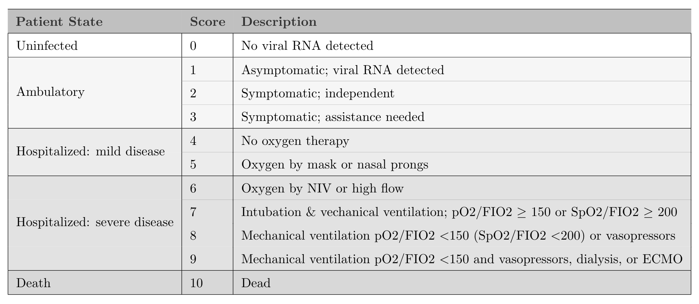

If it's true that many readers of a journal article focus on the abstract, figures and tables while skimming the rest, it is particularly important tell your story with a well conceived graphic or two. Along with a group of collaborators, I am trying to figure out the best way to represent an ordered categorical outcome from an RCT. In this case, there are a lot of categories, so the images can get confusing. I'm sharing a few of the possibilities that I've tried so far, including the code.

The motivation for this work is a data set we don't have yet. The ongoing [CONTAIN](https://bit.ly/3b7aZCr){target="_blank"} trial is a large multi-site trial evaluating the effectiveness of using COVID-19 convalescent plasma (CP) to treat newly hospitalized patients with COVID-19. The primary outcome is a World Health Organization (WHO) score that ranges from 0 to 10, where 0 is healthy and virus-free and 10 is death:



The primary goal of the study is to show whether patients receiving CP are more likely to have better outcomes (i.e. score lower on the WHO 11-point scale) 14 days after randomization compared to those who receive a saline solution placebo.

The analysis will use a cumulative proportional odds model, which I have written about previously (see [here](https://www.rdatagen.net/post/a-hidden-process-part-2-of-2/){target="_blank"}, for example). We plan on doing a Bayesian version of the model, but I won't get into that either (I wrote about the Bayes model in the context of a related project [here](https://www.rdatagen.net/post/2021-01-19-should-we-continue-recruiting-patients-an-application-of-bayesian-predictive-probabilities/){target="_blank"}). Rather, I will show four options for presenting the data in a way that highlights the treatment effect (or lack thereof). Often, when I'm blogging, I'll skip over the `ggplot` code, but that is the point here so you'll see everything.

### The data

Since I don't have access to the actual data, simulated data will have to suffice. The data generation process I'm using is quite simple:

1. generate 1000 individuals
2. randomize to treatment and control using a 1:1 ratio
3. specify baseline probabilities for the distribution of outcomes in the control arm
4. outcome probabilities in the treatment arm are based on an assumed log cumulative odds ratio of -0.6 (which translates to a cumulative odds ratio of 0.55). 

The odds we are talking about are

$$
Odds = \frac{P(WHO \ge y)}{P(WHO < y)}, \ \ y \in \{2,\dots,10\},
$$
so it should be clear that lower odds is preferred.

Here is the data generation code:

```{r gendata}
library(simstudy)
library(data.table)
library(ggplot2)

def <- defDataAdd(varname = "z", formula = "rx * -0.6", dist = "nonrandom")

set.seed(39821)

dd <- genData(1000)
dd <- trtAssign(dd, grpName = "rx")
dd <- addColumns(def, dd)

dd <- genOrdCat(
  dd, 
  adjVar = "z", 
  baseprobs = c(0.06, 0.06, 0.10, 0.10, 0.10, 0.13, 0.13, 0.10, 0.10, 0.06, 0.06),
  catVar = "WHO"
)
```

### Summarizing the data

In the plots that follow, I'll be using summary data: proportions and cumulative proportions of patients that fall into each category:

```{r dsum}
dsum <- dd[, .(N = sum(.N)), keyby = .(rx, WHO)]
dsum[, rx := factor(rx, labels = c("control", "treatment"))]
dsum
```

I'll also need the total number of patients in each arm so that I can provide informative labels:

```{r dnames}
dnames <- dsum[, sum(N), keyby = rx]
dnames[, legend_label := paste0(rx, " (n = ", V1, ")")]
dnames[, axis_label := paste0(rx, "\n(n = ", V1, ")")]
dnames
```

### Proportions by arm

The first plot is quite straightforward, showing the proportion of each arm that falls in each category. This plot allows us to see right away that the treatment arm has more patients in the lower categories. While not particularly elegant, the plot makes it quite easy to gauge the relative proportions:

```{r plot1, fig.height = 3.5, fig.width = 5}
dsum[, prop := N/sum(N), keyby = rx]
dsum[, legend_label := factor(rx, labels = dnames[, legend_label])]

ggplot(data = dsum, aes(x = WHO, y = prop)) +
  geom_line(aes(group = legend_label, color = legend_label), size = 1) +
  geom_point(aes(color = legend_label), size = 2) +
  ylim(0, 0.2) +
  theme(panel.grid = element_blank(),
        legend.title = element_blank(),
        legend.position = c(.8, .88),
        legend.background = element_rect(fill = "grey92"),
        legend.key = element_rect(fill = "grey92")) +
  scale_color_manual(values = c("#798E87", "#C27D38"),
                     guide = guide_legend(revers = TRUE)) +
  scale_x_discrete(labels = c("virus-free", 1:9, "died")) +
  ylab("proportion") +
  xlab("WHO score")
```

### Cumulative proportion by arm

A slightly nicer version of the proportional line plot might be the same idea but with cumulative probabilities or proportions. We again can easily see that the treatment is having the desired effect, as the cumulative proportion is higher at the low end of the scale. I actually like this one, but it may be harder for folks to interpret, particularly if they haven't worked with ordinal data extensively. Perhaps the first plot and this one in tandem would work well to give a complete picture.

```{r plot2, fig.height = 3.5, fig.width = 5}
dsum[, cumprop := cumsum(prop), keyby = rx]

ggplot(data = dsum, aes(x = WHO, y = cumprop)) +
  geom_line(aes(group = legend_label, color = legend_label), size = 1) +
  geom_point(aes(color = legend_label), size = 2) +
  scale_x_discrete(labels = c("virus-free", 1:9, "died")) +
  ylim(0, 1) +
  theme(panel.grid = element_blank(),
        legend.title = element_blank(),
        legend.position = c(.75, .2),
        legend.background = element_rect(fill = "grey92"),
        legend.key = element_rect(fill = "grey92")) +
  scale_color_manual(values = c("#798E87", "#C27D38"),
                     guide = guide_legend(revers = TRUE)) +
  ylab("cumulative proportion") +
  xlab("WHO score")
```

### Distribution of outcome using stacked bars

The next one was inspired by a recent [paper](https://jamanetwork.com/journals/jama/fullarticle/2772922){target="_blank"} describing the results of an RCT assessing the effect of Hydroxychloroquine on COVID-19 patients. The plot is packed with information, but is still simple enough to understand. With a large number of categories, the stacked bars might not make it completely obvious that treatment appears effective. By using more colors, we might be able to overcome this. But I've reserved that for the final plot.

```{r plot3, fig.height = 7, fig.width = 5}
cc <- scales::seq_gradient_pal("#267efa", "white")(seq(0,1,length.out=11))
dsum[, linept := (rx == "treatment") * (2 - 0.3) + (rx == "control") * (1 + 0.3)]
dsum[, axis_label := factor(rx, labels = dnames[, axis_label])]

ggplot(data = dsum, aes( fill = WHO, y = N, x = axis_label)) +
  geom_bar(position=position_fill(reverse=TRUE), 
           stat = "identity", width = 0.6) +
  geom_line(aes(x = linept, y = N), 
            position = position_fill(reverse = TRUE),
            lty = 3, size = .2, color = "black") +
  geom_text(aes(label = scales::percent(prop, accuracy = 1L), y = prop),
            position = position_stack(vjust = 0.5, reverse= TRUE),
            size = 2.5, color = "grey20") +
  theme(axis.title.x = element_blank(),
        panel.grid = element_blank(),
        legend.title = element_text(size = 8, face = "bold")) +
  scale_fill_manual(
    values = cc, 
    name = "WHO score", 
    labels = c("virus-free", 1:9, "died"),
    guide = guide_legend(reverse = TRUE)) +
  ylab("proportion")
```

### Distribution of outcome using divergent bars

In this last version, the stacked bars are rotated and shifted so that they diverge from the middle of the WHO scale. This emphasizes that the treatment arm does appear to have a higher proportion of patients who are doing relatively well. This divergent plot is a bit trickier to pull off manually using `ggplot`, and requires some manipulation of the factors to make it work out the way we want. 

```{r plot4, fig.height = 4, fig.width = 8}
cc_low <- scales::seq_gradient_pal("#faa226", "white")(seq(0.2, 0.8, length.out=4))
cc_high <- scales::seq_gradient_pal("white", "#267efa")(seq(0.2, 0.8, length.out=7))
cc <- c(cc_low, cc_high)

dsum[, w_alt := factor(WHO, levels = 1:11, labels=letters[1:11])]
dsum_low <- dsum[as.numeric(w_alt) %in% c(1:4)]
dsum_high <- dsum[as.numeric(w_alt) %in% c(5:11)]
dsum_high[, w_alt := factor(w_alt, levels = letters[11:5])]

ggplot() +
  geom_bar(
    data = dsum_low,
    aes(x = axis_label, y = -prop, fill = w_alt),
    width = .6, stat="identity") +
  geom_bar(
    data = dsum_high,
    aes(x = axis_label, y = prop, fill = w_alt),
    width = .6, stat="identity") +
  scale_fill_manual(
    values = cc, 
    name = "WHO score", 
    labels = c("virus-free", 1:9, "died")) +
  ylab("proportion") +
  theme(panel.grid = element_blank(),
        axis.title.y = element_blank(),
        legend.title = element_text(size = 8, face = "bold")) + 
  scale_y_continuous(limits = c(-.50,.75), 
    breaks = c(-.50, -.25, 0, 0.25, .5, .75), 
    labels = c("50%", "25%","0%", "25%", "50%","75%")) +
  geom_hline(yintercept = 0, color = "grey96") +
  coord_flip() 
```

In the end, it is difficult to say which approach will be preferable - I think it will depend on the actual data and the differences between the groups. Of course, not all journals permit color, so that would certainly influence the design. But this is a good start: it gives us plenty to play around with once the data do finally arrive.