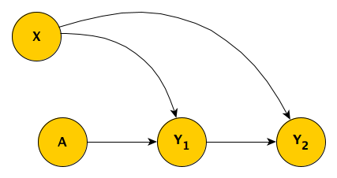
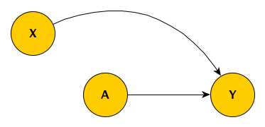
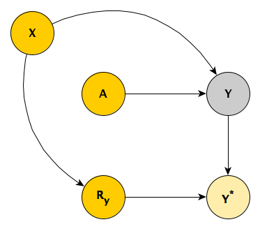
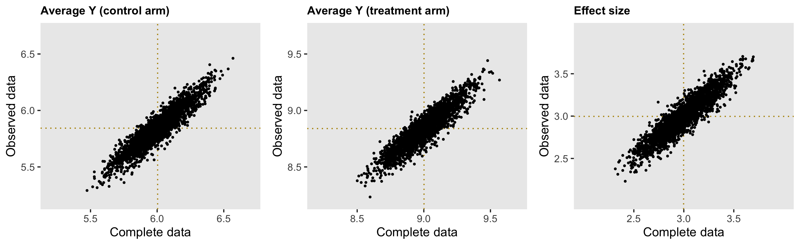
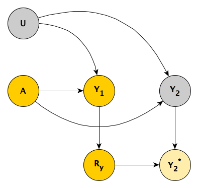
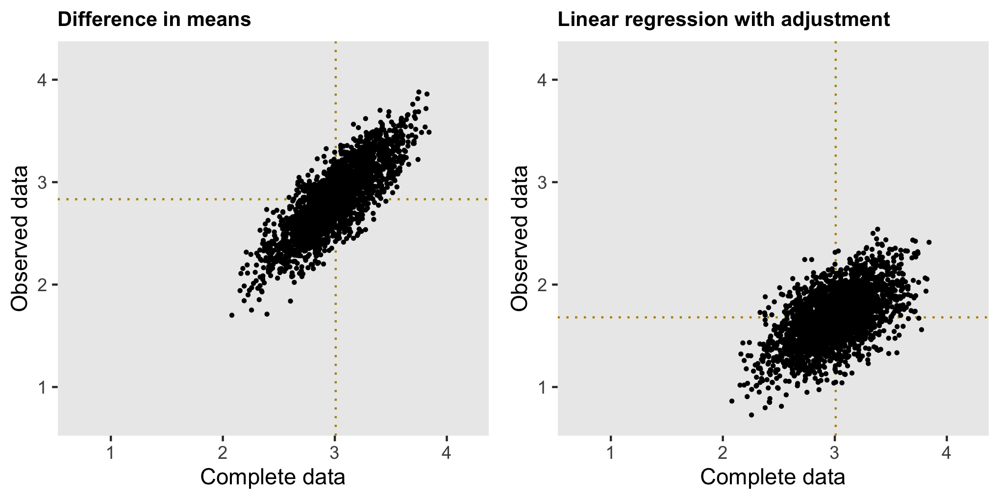
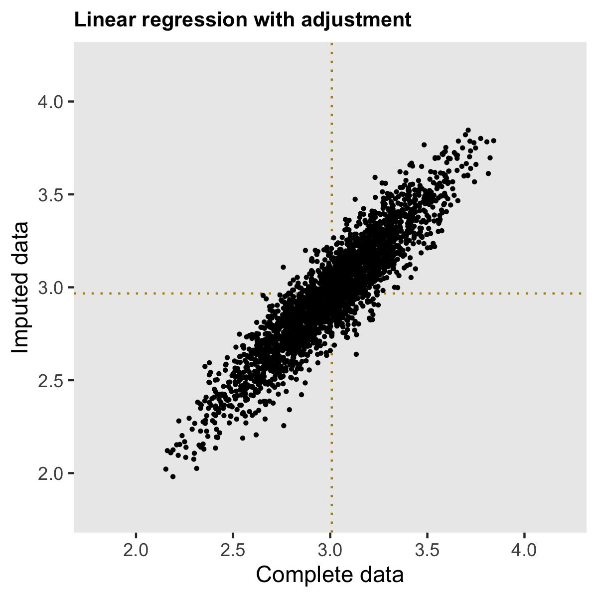

```{r, echo=FALSE}
options(digits = 2)
```

I thought I'd written about this before, but I searched through my posts and I couldn't find what I was looking for. So, if I am repeating myself, my apologies. I actually explored [missing data](https://www.rdatagen.net/post/musings-on-missing-data/){target="_blank"} a couple of years ago, using directed acyclic graphs (DAGs) to help understand the various missing data mechanisms (MAR, MCAR, and MNAR). The DAGs provided insight into when we can use observed data to provide us with unbiased estimates of population quantities even though some of the observations are missing some information.

In that original post, I mentioned that I might have more to say at some point in the future. Well, two years later I am thinking about missing data in the context of an ongoing randomized controlled trial, and the research team has been discussing various ways to address the potential biases that this missing information might be introducing into the analysis. The analytic framework for this trial is Bayesian, so I need to incorporate a missing data analysis into this specific context. The group has decided that we need to use some form of imputation of the missing data, but I wanted to be clear why imputation might actually be necessary. After all, it is quite well known that imputation may not be necessary (see this [post](https://statisticalhorizons.com/ml-is-better-than-mi){target="_blank"}, for example.) So, I had to convince myself that it was necessary in this case before implementing the analysis.

### The study design and data collection

The actual RCT is a considerably more complicated than I am describing here, but I want to keep it as simple as possible to highlight a key point or two. In this simplified study, individuals are randomized to one of two study arms $A$, where $A_i=1$ if patient $i$ is in the treatment arm, and $A_i = 0$ if the the patient is in the control arm.  We measure the outcome $Y$ at two time points, so we have $Y_1$ and $Y_2$; our primary interest, however, is $Y_2$. We are unable to measure a key covariate $U$ that influences both $Y_1$ and $Y_2$. This is the true underlying DAG:

{width=40%}

There could be a scenario where there is an arrow between $Y_1$ and $Y_2$, but not in this case. Its absence doesn't really change the discussion. Our primary interest is estimating the strength of the effect that $A$ has directly on $Y_2$, so we wouldn't want to adjust for $Y_1$, as will introduce bias. (See [here](https://www.rdatagen.net/post/another-reason-to-be-careful-about-what-you-control-for/){target="_blank"} for a discussion of what happens when you control for a collider such as $Y_1$.)

### Simulation of a somewhat simplified scenario

Ultimately, I want to describe how we estimate the causal effect in the event that $Y_2$ is not measured for all subjects. But before we do that, let's simplify things even further. In this second scenario, there is only a single outcome measurement $Y$, though we have managed to measure the key baseline covariate, which is $X$:

{width=40%}

It turns out we have been able to collect the outcome measurement $Y$ for only a subset of the sample, so that we observe $Y^*$ that includes missing values for some of the subjects. In this case, the missing data mechanism is missing at random (MAR), where the level of the observed baseline covariate $X$ determines the probability of observing $Y$. The indicator $R_y = 1$ when we do observe $Y$ and $R_y = 0$ when we do not.

{width=40%}

Here are the libraries necessary for the simulations:

```{r, message=FALSE, warning=FALSE}
library(simstudy)
library(ggplot2)
library(broom)
library(data.table)
library(mice)
```

The data definitions establish the relationship between $A$, $X$ and $Y$ (the treatment effect of $A$ on $Y$ is 3.0), as well as create a missingness mechanism for $Y$ that is a function $X$. 

```{r}
def1 <- defData(varname = "x", formula=0, variance = 1, dist = "normal")

def2 <- defDataAdd(varname = "y", formula = "6 + 3*a + 1*x", variance = 3)

defm <- defMiss(varname = "y", formula = "-3.2 + 2*x", logit.link = TRUE)
```

To generate the observed data, we first generate a complete data set (based on the data definitions), a missing data matrix, and then the observed data set which includes $\text{NA}$'s for about 12\% of the $Y$'s.

```{r}
set.seed(98723)

dd <- genData(500, def1)
dd <- trtAssign(dd, grpName = "a")
dd <- addColumns(def2, dd)

ddmiss <- genMiss(dd, defm, id = "id")
ddobs <- genObs(dd, ddmiss, id = "id")

ddobs
```

The full data set `dd` (without any missing data), we can get a point estimate of the treatment effect merely by calculating $\bar{Y}_{a=1} - \bar{Y}_{a=0}$:

```{r}
dd[, .(avg = mean(y)), keyby = a][ , avg - shift(avg)][2]
```

There is no reason to believe that $\bar{Y^*}_{a=1}$ = $\bar{Y}_{a=1}$ or $\bar{Y^*}_{a=0}$ = $\bar{Y}_{a=0}$. Observations with higher values of $X$ (and thus higher values of $Y$) are more likely to have missing $Y$'s, so the average observed values in both treatment groups should be lower. And this seems to be the case with this data set:

```{r}
dd[, .(avg = mean(y)), keyby = a]
ddobs[, (avg = mean(y, na.rm = TRUE)), keyby = a]
```

But, it looks like, in this case at least, the bias in estimates of the means just using the observed values are offsetting, so that the estimate of the *difference* is unbiased:

```{r}
ddobs[!is.na(y), .(avg = mean(y)), keyby = a][ , avg - shift(avg)][2]    
```

If this is the case more generally for data sets generated using this mechanism, it may turn out we don't need to worry at all about the missing data; even though we know it is MAR, we might be able to treat it as MCAR, and just use the complete observations only without any adjustment or imputation.

Simulating 2500 data sets using steps outlined above provides insight into the nature of the bias. The plot shows the estimate for each data set, and it is clear that the estimates of the average outcome in each arm are biased when we do not take into consideration the missingness. However, the bias is removed when we are considering the treatment effect, which is our primary interest. In this (perhaps overly) simplistic scenario, there is no price to pay when ignoring the missing data.




### Scenario with repeated measurements

The original scenario that motivated this post with an added missing data mechanism is depicted in the next DAG. Those with higher scores in the first period are more likely to have missing values in the second time period, perhaps because they have improved sufficiently and no longer feel like participating in the study.

{width=40%}

The DAG is implemented with these definitions:

```{r}
def1 <- defData(varname = "u", formula=0, variance = 1, dist = "normal")

def2 <- defDataAdd(varname = "y1", formula = "5 + 2*a + 2*u", variance = 2)
def2 <- defDataAdd(def2, "y2", formula = "6 + 3*a + 2*u", variance = 2)

defm <- defMiss(varname = "y2", formula = "-3.5 + 0.4*y1", logit.link = TRUE)
```

And we can go ahead a generate a complete data set, a missing data matrix, and an observed data set with missing values.

```{r}
set.seed(67124)

dd <- genData(500, def1)
dd <- trtAssign(dd, grpName = "a")
dd <- addColumns(def2, dd)

dmiss <- genMiss(dd, defm, id = "id")
dobs <- genObs(dd, dmiss, id = "id")
```

The estimate of the effect size using the difference in averages from the complete data set is 2.9:

```{r}
dd[, .(avg = mean(y2)), keyby = a][ , avg - shift(avg)][2]    
```

Unlike the simplified case, the estimate of the effect size using the difference in averages is attenuated, and is possibly biased, coming in slightly lower at 2.6:

```{r}
dobs[!is.na(y2), .(avg = mean(y2)), keyby = a][ , avg - shift(avg)][2]
```

If we suspect that the bias is due to the fact that first period measurement is a predictor of missingness in the second period, we might be tempted to use a regression model that adjusts for the first period measurement to estimate the treatment effect. However, controlling for $Y_1$, which is a collider, only induces additional bias, and indeed, the estimate is even further away from the truth.

```{r}
tidy(lm(y2 ~ y1 + a, data = dobs))
```

So, in this case, where missingness is a function of a variable that

```{r}
library(mice)
imp <- mice(dobs[,-"id"], m=20, maxit=5, print=FALSE)

fit <- with(imp, lm(y2 ~ a))
summary(pool(fit))
```

{width=70%}

{width=40%}

## Addendum

In case you'd like to play around with other scenarios, I'm including the code that will allow you to repeatedly sample data sets:

```{r, eval=FALSE}
#--- Data definitions

d1 <- defData(varname = "u", formula=0, variance = 1, dist = "normal")

d2 <- defDataAdd(varname = "y1", formula = "5 + a*2 + u*2", variance = 2)
d2 <- defDataAdd(d2, "y2", formula = "6 + a*3 + u*2", variance = 2)

dm <- defMiss(varname = "y2", formula = "-3.5 + 0.4*y1", logit.link = TRUE)

#--- 

s_generate <- function(n) {
  
  dd <- genData(n, d1)
  dd <- trtAssign(dd, grpName = "a")
  dd <- addColumns(d2, dd)
  
  dmiss <- genMiss(dd, dm, id = "id")
  dobs <- genObs(dd, dmiss, id = "id")
  
  return(list(dd, dobs))
  
}

s_replicate <- function(n) {
  
  dsets <- s_generate(n)
  est.complete <- coef(lm(y2 ~ a, data = dsets[[1]]))["a"]
  est.obs <- coef(lm(y2 ~ y1 + a, data = dsets[[2]]))["a"]
  
  imp <- mice(dsets[[2]][,-"id"], m=20, maxit=5, print=FALSE)
  
  fit <- with(imp, lm(y2 ~ a))
  pooled.ests <- summary(pool(fit))
  est.impute <- pooled.ests$estimate[2]
  
  diff.complete <- dsets[[1]][, .(avg = mean(y2)), keyby = a][ , avg - shift(avg)][2]    
  diff.obs<- dsets[[2]][!is.na(y2), .(avg = mean(y2)), keyby = a][ , avg - shift(avg)][2] 
  
  return(data.table(est.complete, diff.complete, est.obs, diff.obs, est.impute))
}

results <- rbindlist(mclapply(1:2500, function(x) s_replicate(300), mc.cores = 4))
```
