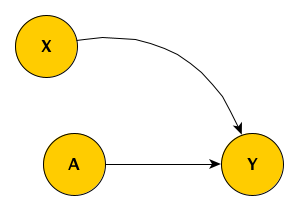

```{r, echo=FALSE}
options(digits = 2)
```

I thought I'd written about this before, but I searched through my posts and I couldn't find what I was looking for. So, if I am repeating myself, my apologies. I [explored](https://www.rdatagen.net/post/musings-on-missing-data/){target="_blank"} missing data two years ago, using directed acyclic graphs (DAGs) to help understand the various missing data mechanisms (MAR, MCAR, and MNAR). The DAGs provided insight into when it is appropriate to use observed data to provide us with unbiased estimates of population quantities even though some of the observations are missing some information.

In that original post, I mentioned I might have more to say at some point in the future. Well, two years later I am again thinking about missing data, this time in the context of an ongoing randomized controlled trial. The research team has been discussing various ways to address potential biases that missing information might be introducing into the analysis. The group has decided that we need to use imputation to fill in the missing data, but I wanted to be clear why this added step is called for. After all, it is quite well known that imputation may not be necessary in light of missing data (see this [post](https://statisticalhorizons.com/ml-is-better-than-mi){target="_blank"}, for example.)

I've created three scenarios with data missing at random (MAR); MAR means that the probability of missingess is a function of observed data. In the first case, surprisingly, the treatment effect can be estimated simply by comparing the means. In the second case, comparing the means is not appropriate, but adjustment for the predictor of missingness sufficient, no imputation needed. And in the third case, neither a simple comparison nor a modeling adjustment do the trick; imputation is necessary.

### A little background for context

The actual RCT is considerably more complicated than I am describing here, but this is the general idea. Individuals are randomized to one of two study arms $A$, where $A_i=1$ if patient $i$ is in the treatment arm, and $A_i = 0$ if the the patient is in the control arm.  We measure the outcome $Y$ at two time points, so we have $Y_1$ and $Y_2$; our primary interest, however, is $Y_2$. We measure a key covariate $X$ that influences both $Y_1$ and $Y_2$. This is the true underlying DAG:

{width=40%}

The challenge is that, for some patients, the second measurement $Y_2$ is missing, and we believe that $Y_1$ is a good predictor of the missingness pattern. But before getting into this (which is Case #3), I'll start with a simpler scenario.

### Case #1

In the first scenario, there is only a single outcome measurement $Y$, and we have measured $X$. The simplified DAG looks like this:

{width=30%}

Unfortunately, we've only been able to collect the outcome measurement $Y$ for a subset of the sample, so that the observed $Y^*$ includes missing values for some subjects. The missing data mechanism is MAR, because the level of the observed baseline covariate $X$ determines the probability of observing $Y$. The indicator $R_y = 1$ when we do observe $Y$ and $R_y = 0$ when we do not.

{width=35%}

I'll go ahead and simulate data based on this first DAG. In case you'd like to replicate, here are the libraries necessary for the simulations:

```{r, message=FALSE, warning=FALSE}
library(simstudy)
library(ggplot2)
library(broom)
library(data.table)
library(mice)
```

The data definitions establish the relationship between $A$, $X$ and $Y$ (the treatment effect of $A$ on $Y$ is 2.5) as well as create a missingness mechanism for $Y$ that is a function $X$. 

```{r}
def1 <- defData(varname = "x", formula=0.5, dist = "binary")
def2 <- defDataAdd(varname = "y", formula = "5 + 5*x + 2.5*a", variance = 2)
defm <- defMiss(varname = "y", formula = "-3.5 + 2.3*x", logit.link = TRUE)
```

To generate the observed data with missing data, we first generate a complete data set (based on the data definitions), and then we generate a missing data matrix, which finally gives us the observed data set which includes $\text{NA}$'s for about 13\% of the $Y$'s.

```{r}
set.seed(17236)

dd <- genData(500, def1)
dd <- trtAssign(dd, grpName = "a")
dd <- addColumns(def2, dd)

ddmiss <- genMiss(dd, defm, id = "id")
ddobs <- genObs(dd, ddmiss, id = "id")

ddobs
```

Using the full data set `dd` (without any missing data), we can get a point estimate of the treatment effect $\delta$ merely by calculating 

$$\hat{\delta} = \bar{Y}_{a=1} - \bar{Y}_{a=0}$$

```{r}
dd[, .(avg = mean(y)), keyby = a][ , avg - shift(avg)][2]
```

There is no reason to believe that the observed data means are the same as the complete data set means. That is, it is not likely that $\bar{Y^*}_{a=1}$ = $\bar{Y}_{a=1}$ or $\bar{Y^*}_{a=0}$ = $\bar{Y}_{a=0}$. Observations with higher values of $X$ (and thus higher values of $Y$) are more likely to have missing $Y$'s, so the average observed values in both treatment groups should be lower. This seems to be the case here:

```{r}
dd[, .(avg = mean(y)), keyby = a]
ddobs[, (avg = mean(y, na.rm = TRUE)), keyby = a]
```

In the real world, we can only estimate the treatment effect $\delta^*$ with the data that we have:
$$\hat{\delta}^* = \bar{Y}_{a=1}^* - \bar{Y}_{a=0}^*$$

It looks like, in this case at least, the bias in estimates of the means are in the same direction, so that the estimate of the treatment effect based on the *difference* of means in the observed data is unbiased:

```{r}
ddobs[!is.na(y), .(avg = mean(y)), keyby = a][ , avg - shift(avg)][2]    
```

If this is the case more generally for data sets generated using this mechanism, we may not need to worry at all about the missing data mechanism; even though we know it is MAR, we might be able to treat it as MCAR, and just use the observed measurements only, without any adjustment or imputation.

Simulating 2500 data sets using steps outlined above provides insight into the nature of the bias. (I've provided generic for generating repeated data sets in the <a href="#addendum">addendum</a>.) The estimates based on the complete data set are shown on the $x$ axis, and the observed data estimates are on the $y$ axis. The dotted lines show the average of the estimates for the complete and observed data sets, respectively.

The plot shows the estimate for each data set. For both treatment arms, the average estimate is centered around the true value (used in the data generation process).  The average estimate for each arm is biased downwards when we do not take into consideration the missingness. 

{width=70%}

However, the bias is removed when we are considering the treatment effect, which is our primary interest. In this (perhaps overly) simplistic scenario, there is no price to pay when ignoring the missing data. Both estimates are centered around 2.5, the true value.

{width=40%}

### Case #2

The second example differs from the first only in one respect: the size of the intervention effect depends on the baseline covariate $X$ (the line drawn from $X$ to the arrow connecting $A$ and $Y$ represents this effect modification).

{width=35%}

In the example, $\delta_0 = 1$ for the sub-population with $X = 0$, and $\delta_1 = 4$ for the sub-population with $X = 1$. If the population is evenly distributed between $X=0$ and $X=1$, then we would observe an overall effect $\delta = 2.5$.

```{r}
d1 <- defData(varname = "x", formula=0.5, dist = "binary")
d2 <- defDataAdd(varname = "y", formula = "6 + 1*a + 2*x + 3*a*x", variance = 2)
dm <- defMiss(varname = "y", formula = "-3.5 + 2.3*x", logit.link = TRUE)
```

This time around, if we go ahead and naïvely estimate $\delta^* = \bar{Y}_{a=1}^* - \bar{Y}_{a=0}^*$, the estimate will be biased.

{width=40%}

The reason for this bias is that higher values of $Y$ are more likely to be missing:  the presence of of $X$ both drives $Y$ higher *and* increases the likelihood of missingness. Even though the rate of missingness is the same across the arms, the missing values in the treatment arm are on average higher ...

{width=70%}

### Case #3

The original scenario that motivated this post with an added missing data mechanism is depicted in the next DAG. Those with higher scores in the first period are more likely to have missing values in the second time period, perhaps because they have improved sufficiently and no longer feel like participating in the study.

There could be a scenario where there is an arrow between $Y_1$ and $Y_2$, but not in this case. Its absence doesn't really change the discussion. Our primary interest is estimating the strength of the effect that $A$ has directly on $Y_2$, so we wouldn't want to adjust for $Y_1$, as will introduce bias. (See [here](https://www.rdatagen.net/post/another-reason-to-be-careful-about-what-you-control-for/){target="_blank"} for a discussion of what happens when you control for a collider such as $Y_1$.)

{width=40%}

The DAG is implemented with these definitions:

```{r}
def1 <- defData(varname = "u", formula=0, variance = 1, dist = "normal")

def2 <- defDataAdd(varname = "y1", formula = "5 + 2*a + 2*u", variance = 2)
def2 <- defDataAdd(def2, "y2", formula = "6 + 3*a + 2*u", variance = 2)

defm <- defMiss(varname = "y2", formula = "-3.5 + 0.4*y1", logit.link = TRUE)
```

And we can go ahead a generate a complete data set, a missing data matrix, and an observed data set with missing values.

```{r}
set.seed(67124)

dd <- genData(500, def1)
dd <- trtAssign(dd, grpName = "a")
dd <- addColumns(def2, dd)

dmiss <- genMiss(dd, defm, id = "id")
dobs <- genObs(dd, dmiss, id = "id")
```

The estimate of the effect size using the difference in averages from the complete data set is 2.9:

```{r}
dd[, .(avg = mean(y2)), keyby = a][ , avg - shift(avg)][2]    
```

Unlike the simplified case, the estimate of the effect size using the difference in averages is attenuated, and is possibly biased, coming in slightly lower at 2.6:

```{r}
dobs[!is.na(y2), .(avg = mean(y2)), keyby = a][ , avg - shift(avg)][2]
```

If we suspect that the bias is due to the fact that first period measurement is a predictor of missingness in the second period, we might be tempted to use a regression model that adjusts for the first period measurement to estimate the treatment effect. However, controlling for $Y_1$, which is a collider, only induces additional bias, and indeed, the estimate is even further away from the truth.

```{r}
tidy(lm(y2 ~ y1 + a, data = dobs))
```

So, in this case, where missingness is a function of a variable that

```{r}
library(mice)
imp <- mice(dobs[,-"id"], m=20, maxit=5, print=FALSE)

fit <- with(imp, lm(y2 ~ a))
summary(pool(fit))
```

{width=70%}

{width=40%}

<br />

<a name="addendum"></a> 

### Addendum

In case you'd like to play around with other scenarios, I'm including the code that will allow you to repeatedly sample data sets. Just provide you our data definitions.

```{r, eval=FALSE}
s_generate <- function(n) {
  
  dd <- genData(n, d1)
  dd <- trtAssign(dd, grpName = "a")
  dd <- addColumns(d2, dd)
  
  dmiss <- genMiss(dd, dm, id = "id")
  dobs <- genObs(dd, dmiss, id = "id")
  
  return(list(dd, dobs))
  
}

s_replicate <- function(n) {
  
  dsets <- s_generate(n)
  est.complete <- coef(lm(y2 ~ a, data = dsets[[1]]))["a"]
  est.obs <- coef(lm(y2 ~ y1 + a, data = dsets[[2]]))["a"]
  
  imp <- mice(dsets[[2]][,-"id"], m=20, maxit=5, print=FALSE)
  
  fit <- with(imp, lm(y2 ~ a))
  pooled.ests <- summary(pool(fit))
  est.impute <- pooled.ests$estimate[2]
  
  diff.complete <- dsets[[1]][, .(avg = mean(y2)), keyby = a][ , avg - shift(avg)][2]    
  diff.obs<- dsets[[2]][!is.na(y2), .(avg = mean(y2)), keyby = a][ , avg - shift(avg)][2] 
  
  return(data.table(est.complete, diff.complete, est.obs, diff.obs, est.impute))
}

results <- rbindlist(mclapply(1:2500, function(x) s_replicate(300), mc.cores = 4))
```
