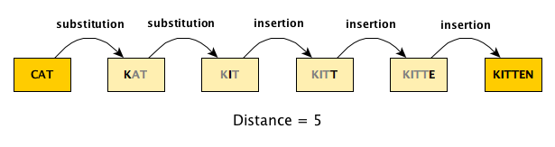

Health data systems are not always perfect, a point that was made quite obvious when a study I am involved with required a matched list of nursing home residents taken from one system with set results from PCR tests for COVID-19 drawn from another. Name spellings for the same person from the second list were not always consistent across different PCR tests, nor were they always consistent with the cohort we were interested in studying defined by the first list. My research associate, Yifan Xu, and I were asked to see what we could do to help out.

This is my first foray into fuzzy word-matching. We came up with simple solution to match the names on the two lists based on the `R` function `adist` that should allow the research team to finalize a matched list with minimal manual effort. 

In order to test our proposed approach, we developed a way to generate random lists of names with errors. This post presents both the code for random list generation with errors as well as the simple matching algorithm.

### Distance between strings

Fuzzy word matching can be approached using the concept of *string distance*. Quite simply, this can be measured by counting the number of transformations required to move from the original to the target word. A transformation is one of three moves: (1) a substitution, (2) an insertion, or (3) a deletion. The figure below illustrates the 5 "moves" that are required to get from **CAT** to **KITTEN**: two substitutions and three insertions.

{width=80%}

The `adist` function can calculate this string distance, and if you set `counts = TRUE`, the function will provide the number of substitutions, insertions, and deletions. Here are the results for our example:

```{r}
adist("CAT", "KITTEN", counts = TRUE)
```

Assessing whether a distance is meaningful or no longer fuzzy certainly depends on the nature of the problem and the length of a strings. The distance from **CAT** to **DOG** is 3 (with 3 substitutions), and so is the distance from **DERE, STEPHEN** to **DEERE, STEVEN** (1 insertion, 1 deletion, and 1 substitution); we might be willing to declare the individual's name a match while declining to pair the two different animals.

### Simulating lists of names with errors

To test out our fuzzy matching process, we need to be able to create a master list of names from which we can create two sub-lists: (1) the cohort list of nursing home residents with correct name spellings, and (2) the list of PCR records that includes multiple records (test results) per individual, with possible inconsistent name spellings across the different tests for a specific person.

#### Generating names

The master list can easily be generated using the `randomNames` function in the R package [randomNames](https://centerforassessment.github.io/randomNames/){target="_blank"}. A call to this function provides samples of names from a large scale database. (It provides gender and ethnic variation if you need it.)

```{r}
library(data.table)
library(randomNames)

set.seed(6251)
randomNames(4)
```

#### Generating errors

To facilitate the generation of spelling errors, I've created a function that takes a string, a specified number of substitutions, a number of insertions (if negative then these are deletions), and an indicator that flips the order of the names (typically "Last Name, First Name"):

```{r}
mis_string <- function(name, subs = 1, ins = 0, flip = FALSE) {
  
  names <- trimws(unlist(strsplit(name, split = ",")))
  
  if (subs) {
    for (i in 1 : subs) {
      change <- sample(1:2, 1)
      ii <- sample(nchar(names[change]), 1)
      l <- substr(names[change], ii, ii)
      s <- sample(letters[letters != l], 1)
      names[change] <- sub(l, s, names[change]) 
    }
  }
  
  if (ins > 0) {
    for (i in 1 : ins) {
      change <- sample(c(1, 2), 1)
      ii <- sample(nchar(names[change]), 1)
      stringi::stri_sub(names[change], ii, ii-1) <- sample(letters, 1)
    }
  }
  
  if (ins < 0) {
    for (i in 1 : -ins) {
      change <- sample(c(1, 2), 1)
      ii <- sample(nchar(names[change]), 1)
      stringi::stri_sub(names[change], ii, ii) <- ""
    }
  }
  
  paste(names[flip + 1], names[2 - flip], sep = ", ")
  
}
```

Here are two applications of `mis_string` on the name "Vazquez Topete, Deyanira":

```{r}
mis_string("Vazquez Topete, Deyanira", subs = 2, ins = 2)
mis_string("Vazquez Topete, Deyanira", subs = 1, ins = -2, flip = TRUE)
```

#### Master list definitions

To generate the master list we define (using `simstudy`) a set of key parameters: an indicator `pcr` identifying whether the person has at least one test (70% will have a test), an indicator `resident` identifying whether the person is part of our resident cohort (20% of those on the master list will be residents), and a variable for the number of tests an individual has (conditional on having at least 1 test). There will be names on the master list that do not have any tests nor are they a resident; these patients are removed from the master list.

```{r}
library(simstudy)

def_n <- defDataAdd(varname = "pcr", formula = 0.7, dist="binary")
def_n <- defDataAdd(def_n, varname = "resident", formula = 0.2, dist="binary")
def_n <- defDataAdd(def_n, varname = "n_tests", formula = 3, dist="noZeroPoisson")
```

#### PCR list error definitions

Each person with a PCR test will have one or more records in the PCR list. The following set of definitions indicates the number of substitutions and insertions (both specified as categorical integer variables) as well as whether the first and last names should be flipped.

```{r}
def_p <- defDataAdd(varname = "subs", formula = ".8;.15;.04;.01", dist="categorical")
def_p <- defDataAdd(def_p, varname = "ins", 
  formula = "0.02;0.05;0.86;0.05;0.02", dist="categorical")
def_p <- defDataAdd(def_p, varname = "flip", formula = 0.10, dist="binary")
```

#### Generating the data

In this simulation I am generating 50 possible names:

```{r}
set.seed(3695)

n <- 50

d_master <- data.table(id = 1:n, name = randomNames(n))
d_master <- addColumns(def_n, d_master)
d_master <- d_master[(pcr | resident)]

head(d_master)
```

In this case, there are be 7 individuals in the resident cohort and 40 individuals have at least one PCR test. 5 residents were tested:

```{r} 
d_master[, .(
    num_res = sum(resident), 
    num_pcr = sum(pcr), 
    num_both = sum( (resident & pcr) )
  )
]
```

The PCR list will have 110 total tests for the 40 people with tests.

```{r}
d_pcr <- genCluster(d_master[pcr == 1], "id", "n_tests", "pcr_id")
d_pcr <- addColumns(def_p, d_pcr)
d_pcr[, subs := subs - 1]
d_pcr[, ins := ins - 3]
d_pcr[, obs_name := mapply(mis_string, name, subs, ins, flip)]

d_pcr[, .(pcr_id, id, name, obs_name, subs, ins, flip)]
```

We end up with two lists - one with just residents only and one with a list of PCR tests. This is mimicking the actual data we might get from our flawed health data systems.

```{r}
d_res <- d_master[resident == 1, .(id, name)]
d_pcr <- d_pcr[, .(pcr_id, id, name = obs_name, pcr)]
```

#### The truth

Before proceeding to the matching, here is a PCR test records for the residents. This is the correct match that we hope to recover.

```{r}
d_pcr[ id %in% d_res$id]
```

### Fuzzy matching of simulated data

The fuzzy matching is quite simple (and I've simplified even more by ignoring the possibility that the data have been flipped). The first step is to merge each PCR row with each resident name, which in this case will result in $7 \times 110 = 770$ rows. The idea is that we will be comparing each of the names from the PCR tests with each of the resident names. In the merged data table `dd`, `x` is the resident name, and `name` is the PCR test list name.

```{r}
dd <- data.table(merge(d_res$name, d_pcr))
dd
```

Next, we calculate the string distance for each pair of strings in `dd`:

```{r}
dd[, pid := .I]
dd[, dist := adist(x, name), keyby = pid]
dd
```

We can refine the matched list of $770$ pairs to include only those that differ by 5 or fewer transformations, and can even create a score based on the distances where a score of 100 represents a perfect match. This refined list can then be reviewed manually to make a final determination in case there are any false matches.

```{r}  
dd <- dd[dist <= 3,]
dd[, score := 100 - 5*dist]
  
dd[, .(staff_name = x, pcr_name = name, pcr_id, pcr, pid, score)]
```

We did pretty well, identifying 12 of the 14 resident records in the PCR data. The two we missed were the result of flipped names.

In practice, a relatively close distance is not necessarily a good match. For example **SMITH, MARY** and **SMITH, JANE** are only separated by three letter substitutions, but they are most likely not the same person. We could minimize this problem if we have additional fields to match on, such as date of birth. This would even allow us to *increase* the string distance we are willing to accept for a possible match without increasing the amount of manual inspection required.
