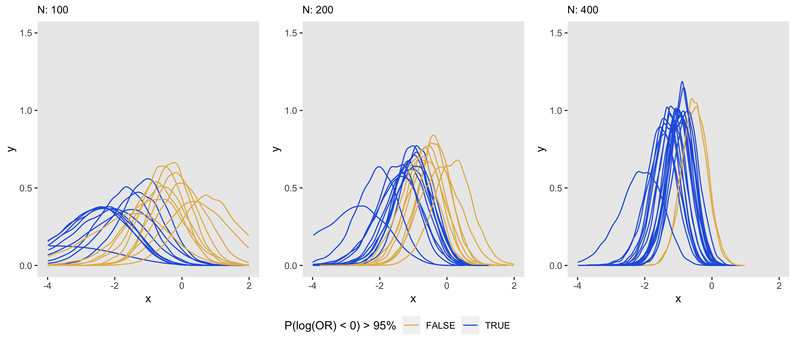
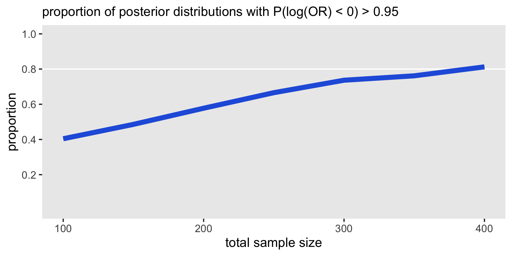

```{r child = 'preamble-latex.tex'}
```

Given my recent involvement with the design of a somewhat complex [trial](https://www.rdatagen.net/post/2021-01-19-should-we-continue-recruiting-patients-an-application-of-bayesian-predictive-probabilities/){target="_blank"} centered around a Bayesian data analysis, I am appreciating more and more that Bayesian approaches are a very real option for clinical trial design. A key element of any study design is sample size. While some would argue that sample size considerations are not critical to the Bayesian design (since Bayesian inference is agnostic to any pre-specified sample size and is not really affected by how frequently you look at the data along the way), it might be a bit of a challenge to submit a grant without telling the potential funders how many subjects you plan on recruiting (since that could have a rather big effect on the level of resources - financial and time - required.)

[Earlier](https://www.rdatagen.net/post/a-frequentist-bayesian-exploring-frequentist-properties-of-bayesian-models/){target="_blank"}, I touched a bit on these issues while discussing the frequentist properties of Bayesian models, but I didn't really get directly into sample size considerations. I've been doing some more exploring and simulating, so I am sharing some of that here.

### Bayesian inference

In the Bayesian framework, all statistical inference is based on the estimated posterior probability distribution for the parameter(s) of interest (say $\theta$) once we have observed the data: $P(\theta | \text{data})$. In addition to extracting the mean or median of the distribution as a point estimate, we can get a measure of uncertainty by extracting quantiles from the distribution (a 95\% interval comes to mind, though there is no reason to be limited by that convention).

Alternatively, we can make a probability statement about the parameter being above or below a threshold of effectiveness. For example if we are estimating a log-odds ratio for an intervention that prevents a bad outcome, we might be interested in $P(log(OR) < 0).$ We may even pre-specify that the trial will be considered a success if $P(log(OR) < 0) > 0.95.$

<!-- ### Statistical power and sample size -->

<!--  This, of course, is in contrast with frequentist inference that is usually based on something like $P(\text{data} | \theta = 0)$.  -->

<!-- The traditional notion of *statistical power* is the probability of rejecting the null hypothesis (i.e. $\theta=0$) given that the true underlying parameter is some $\theta = \myne{\theta_1}{0}$. This probability can be written as $P(D_1 | \theta = \theta_1)$, where $D_1$ is any set of observed data that satisfies $P(D_1 | \theta = 0) < \alpha$, typically with $\alpha = 0.05$. Sample size comes into play because $P(\text{data} | \theta = 0)$ is a function of the number of observations. -->

<!-- This concept of power doesn't translate very well to a Bayesian framework, because here the null hypothesis $\theta = 0$ is not particularly meaningful. However, there is a Bayesian analog of power -->

```{r, message=FALSE, warning=FALSE}
library(simstudy)
library(data.table)
library(ggplot2)
library(cmdstanr)
library(posterior)
library(bayesplot)
```

### Data generation

To investigate, I will use a simple binary outcome $Y$ that is changed by exposure or intervention $A$. In this first case, I will randomly select a log-odds ratio from $N(\mu = -1, \sigma = 0.5).$

```{r, message=FALSE}
defB <- defDataAdd(varname = "Y", formula = "-2 + ..lor * A", 
  dist = "binary", link="logit")

set.seed(21)
lor <- rnorm(1, -1, 0.5)

dT <- genData(200)
dT <- trtAssign(dT, grpName = "A")
dT <- addColumns(defB, dT)
```

### Model fitting

I am primarily interested in recovering the log-odds ratio use to generate the data using a simple Bayesian model, written here in `Stan`. The parameter of interest in the `Stan` model is $\beta$, log-odds ratio. The prior distribution is $t_{student}(df=3, \mu=0, \sigma=5).$

```{stan output.var='priors', eval = FALSE}
data {
  int<lower=0> N;
  int<lower=0,upper=1> y[N];
  vector[N] x;
  real mu;
  real s;
}

parameters {
  real alpha;
  real beta;
}

model {
  beta ~ student_t(3, mu, s);
  y ~ bernoulli_logit(alpha + beta * x);
}
```

To estimate the posterior distribution, I am using the `R` package `cmdstanr`:

```{r, message=FALSE}
mod <- cmdstan_model("code/bayes_logistic.stan")

fit <- mod$sample(
  data =  list(N=nrow(dT), y=dT$Y, x=dT$A, mu=0, s=5),
  refresh = 0,
  chains = 4L,
  parallel_chains = 4L,
  iter_warmup = 1000,
  iter_sampling = 4000,
  step_size = 0.1,
  show_messages = FALSE
)
  
```

(If you're impressed at how fast that model ran, it is because it is on my new MacBook Pro with the new Apple M1 chip - 4 or 5 times faster than my previous MacBook Pro with an Intel chip. It took me a while to get `R`, `RStudio`, and particularly, `cmdstan` up and running, but once I did, it has been totally worth it.)

First thing to check, of course, is whether the sampling from the posterior distribution was well-behaved. Here is a trace plot for the parameter $\beta$:

```{r, fig.width = 4, fig.height=2}
draws_array <- as_draws_array(fit$draws())
mcmc_trace(draws_array, pars = "beta")
```

Here are the summary statistics of the posterior distribution. Based on these data, the median log-odds ratio is $-0.61$ and $P(lor < 0) = 89\%$:

```{r}
res <- data.table(fit$summary(variables = "beta"))[, 
          .(median, sd, q95, len = q95-q5)]

betas <- data.table(beta = as.matrix(draws_array[,,"beta"]))
res$p0 <- mean(betas$beta.V1 < 0)

res
```

A plot of the posterior distribution is the best way to fully assess the state of knowledge about the parameter having observed this data set. The density plot includes a vertical dashed line at the median, and the dark shading indicates lowest $95\%$ of the density. The fact that the cutoff point $0$ lies within the bottom $95\%$ makes it clear that the threshold was not met.

```{r, fig.height=4}
d <- density(draws_array[,,"beta"], n = 1024)
plot_points <- as.data.table(d[c("x", "y")])
median_xy <- plot_points[findInterval(res$median, plot_points$x)]

ggplot(data = plot_points, aes(x = x, y = y)) +
  geom_area(aes(fill = (x < res$q95))) +
  geom_segment(x = median_xy$x, xend=median_xy$x, y=0, yend = median_xy$y,
               size = 0.2, color = "white", lty=3) +
  scale_fill_manual(values = c("#adc3f2", "#5886e5")) +
  theme(panel.grid = element_blank(),
        legend.position = "none")

```

### Bayesian power

If we want to assess what kind of sample sizes we might want to target in study based on this relatively simple design (binary outcome, two-armed trial), we can conduct a Bayesian power analysis that has a somewhat different flavor from the more typical frequentist Bayesian that I typically do with simulation. There are a few resources I've found very useful here: this book by [Spiegelhalter et al](https://onlinelibrary.wiley.com/doi/book/10.1002/0470092602){target="_blank"} and these two papers, one by [Wang & Gelfand](https://projecteuclid.org/journals/statistical-science/volume-17/issue-2/A-simulation-based-approach-to-Bayesian-sample-size-determination-for/10.1214/ss/1030550861.full){target="_blank"} and another by [De Santis & Gubbiotti](https://www.mdpi.com/1660-4601/18/2/595){target="_blank"}

When I conduct a power analysis within a frequentist framework, I usually assume set of *fixed/known* effect sizes, and the hypothesis tests are centered around the frequentist p-value at a specified level of $\alpha$. The Bayesian power analysis differs with respect to these two key elements: a distribution of effect sizes replaces the single fixed effect size to accommodate uncertainty, and the posterior distribution probability threshold (or another criteria such as the variance of the posterior distribution or the length of the 95\% credible interval) replaces the frequentist hypothesis test.

We have a prior distribution of effect sizes. De Santis and Gubbiotti suggest it is not necessary (and perhaps less desirable) to use the same prior used in the model fitting. That means you could use a skeptical (conservative) prior centered around 0, in the analysis, but use a prior for data generation that is consistent with a clinically meaningful effect size. In the example above the *analysis prior* was 

$$ \beta \sim t_{student}(df = 3, \mu = 0, \sigma = 5) $$

and the *data generation prior* was

$$ \beta \sim N(\mu = -1, \sigma = 0.5).$$

To conduct the Bayesian power analysis, I replicated the simulation and model fitting shown above 1000 times for each of seven different sample sizes ranging from 100 to 400. (Even though my laptop is quite speedy, I used the NYU Langone Health high performance cluster Big Purple to do this, because I wanted to save a few hours.) I'm not showing the parallelized code in this post, but take a look [here](https://www.rdatagen.net/post/a-frequentist-bayesian-exploring-frequentist-properties-of-bayesian-models/){target="_blank"} for an example similar to this. (I'm happy to share with anyone if you'd like to have the code.)

The plots below show a sample of 20 posterior distributions taken from the 1000 generated for each of three sample sizes. As in the frequentist context, an increase in sample size appears to reduce the variance of the posterior distribution estimated in a Bayesian model. We can see visually that as the sample size increases, the distribution collapses towards the mean or median, which has a direct impact on how confident we are in drawing conclusions from the data; in this case, it is apparent that as sample size increases, the proportion of posterior distributions meet the 95% threshold increases.



Here is a curve that summarizes the probability of a posterior distribution meeting the 95% threshold at each sample size level. At a size of 400, 80% of the posterior distributions (which are themselves based on data generated from varying effect sizes specified by the *data generation prior* and the *analysis prior*) would lead us to conclude that the trial is success.



<p><small><font color="darkkhaki">

References:

Wang, Fei, and Alan E. Gelfand. "A simulation-based approach to Bayesian sample size determination for performance under a given model and for separating models." *Statistical Science* 17, no. 2 (2002): 193-208.

Spiegelhalter, David J., Keith R. Abrams, and Jonathan P. Myles. *Bayesian approaches to clinical trials and health-care evaluation*. Vol. 13. John Wiley & Sons, 2004.

De Santis, Fulvio, and Stefania Gubbiotti. "Sample Size Requirements for Calibrated Approximate Credible Intervals for Proportions in Clinical Trials." *International Journal of Environmental Research and Public Health* 18, no. 2 (2021): 595.

</font></small></p>

