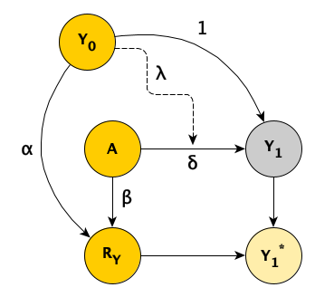

Under normal conditions, conducting a randomized clinical trial is challenging. Throw in a pandemic and things like site selection, patient recruitment and patient follow-up can be particularly vexing. In any study, subjects need to be retained long enough so that outcomes can be measured; during a period when there are so many potential disruptions, this can become quite difficult. This issue of *loss to follow-up* recently came up during a conversation among a group of researchers who were troubleshooting challenges they are all experiencing in their ongoing trials. While everyone agreed that missing outcome data is a significant issue, there was less agreement on how to handle this analytically when estimating treatment effects.

For me, this discussion quickly brought to mind two posts I did on missing data, where I [reflected](https://www.rdatagen.net/post/musings-on-missing-data/){target="_blank"} on the different missing data mechanisms (MCAR, MAR, and NMAR) and  [explored](https://www.rdatagen.net/post/2021-03-30-some-cases-where-imputing-missing-data-matters/){target="_blank"} when it might be imperative to use multiple imputation as part of the analysis.

In light of the recent conversation, I wanted to revisit this issue of loss to follow-up in the context of a clinical trial where the outcome measure is collected at baseline (about which I've written about before, [here](https://www.rdatagen.net/post/thinking-about-the-run-of-the-mill-pre-post-analysis/){target="_blank"} and [here](https://www.rdatagen.net/post/2021-11-23-design-effects-with-baseline-measurements/){target="_blank"}) and we can be fairly certain that this baseline measurement will be quite well balanced at baseline.

### The data generating process

In my earlier posts on missing data, I described the observed and missing data processes using a directly acyclic graphs (DAGs), which allow us to visualize the assumed causal relationships in our model. Here is a DAG for a clinical trial that collects baseline measure $Y$ at baseline ($Y_0$) and again one year later ($Y_1$):

{width=40%}

$A$ is the treatment indicator, $A \in \{0,1\}$, $A=1$ if the patient has been randomized to the treatment arm, and $A=0$ under the control arm. $R_Y$ is a missing data indicator set to 1 if there is loss to follow up (i.e., $Y_1$ is not collected), and 0 otherwise. $Y_1^*$ is the observed value of $Y_1$. If $R_Y = 1$, the value of $Y_1^*$ is *NA* (i.e. missing), otherwise $Y_1 ^*= Y_1$.

In the scenario depicted in this DAG, both $Y_0$ and $A$ potentially influence the (possibly unobserved) outcome $Y_1$ *and* whether there is loss to follow-up $R_Y$. (I have explicitly left out the possibility that $Y_1$ itself can impact missingness, because this is a much more challenging problem - not missing at random or NMAR.)

The strengths of the relationships between the variables are determined by the parameters $\delta$, $\alpha$, and $\beta$. (I have fixed the direct relationship between $Y_0$ and $Y_1$ to a value of 1, but there is no reason that needs to be so.) The dashed line from $Y_0$ to the causal line connecting $A$ and $Y_1$ which has parameter $\lambda$ reflects the possibility that the treatment effect of $A$ will vary across different levels of the baseline measurement (i.e., there is an interaction between $Y_0$ and $A$).

For the purposes of this simulation, I am assuming this linear relationship:

$$Y_{1i} = Y_{0i} + \delta A_i - \lambda A_i Y_{0i} + e_i, \ \ A_i \in \{0, 1\}$$

I am using $-\lambda$ in order to simulate a situation where patients with lower values of $Y_0$ actually have larger overall treatment effects than those with higher values.

$Y_0$ and $e$ are both normally distributed:

$$ Y_{0i} \sim N(\mu =0, \sigma^2 = 1)$$
$$e_i \sim N(\mu =0, \sigma^2 = 0.5)$$

The missing data mechanism is also linear, but on the *logistic* scale. In this scenario, patients with lower baseline values $Y_0$ are more likely to be lost to follow-up than patients with higher values (assuming, of course, $\alpha > 0$):

$$\text{logit}(P(R_{Yi} = 1)) =-1.5 - \alpha Y_{0i} - \beta A_i$$

Under these assumptions, the probability that a patient with baseline measure  $Y_0 = 0$ in the control arm is lost to follow-up is $\frac{1}{1 + exp(1.5)} \approx 18\%$.

### Data simulation

I am using the `simstudy` package to simulate data from these models, which allows me to define the data generating process described above. First, let's load the necessary libraries:

```{r, echo=FALSE}
options(digits = 2)
load("data/summary_stats_adj.rdata")
```

```{r, message=FALSE, warning=FALSE}
library(simstudy)
library(data.table)
library(mice)
```

The table `def` implements the definitions for the data generating process. I've created two versions of $Y_1$. The first is the true underlying value of $Y_1$, and the second $Y_{1_{obs}}$ is really $Y_1^*$ from the DAG. At the outset, there are no missing data, so initially $Y_{1_{obs}}$ is just a replicate of $Y_1$:

```{r}
def <- defData(varname = "y0", formula = 0, variance = 1)
def <- defData(def, "a", formula = "1;1", dist = "trtAssign")
def <- defData(def, "y1", "y0 + ..delta * a - ..lambda * y0 * a", 0.5)
def <- defData(def, "y1_obs", formula = "y1", dist = "nonrandom")
```
  
The missing data generating process is defined in table `defM`:
  
```{r}
defM <- defMiss(
    varname = "y1_obs", 
    formula = "-1.5  - ..alpha * y0 - ..beta * a", 
    logit.link = TRUE
)
```

For this particular simulation, I am assuming $\delta = 1$, $\lambda = 0.8$, $\alpha = 1$, and $\beta = 0$:

```{r}
delta <- 1
lambda <- 0.8

alpha <- 1
beta <- 0
```

With all the definitions and parameters set, we are ready to generate the data:

```{r, warning=FALSE}
RNGkind(kind = "L'Ecuyer-CMRG")
set.seed(1234)

dd <- genData(1200, def)
dmiss <- genMiss(dd, defM, idvars = "id")
dobs <- genObs(dd, dmiss, idvars = "id")

dobs
```

### Estimating the treatment effect

Now, with the data in hand, we can estimate the treatment effect. In this case, I will fit three different models. The first assumes that there was no missing data at all (i.e., we had full access to $Y_1$ for all study participants). The second is an analysis using only cases with complete data, which ignores missing data entirely and assumes that the missing data process is MCAR (missing completely at random). The third analysis uses multiple imputation to generate values for the missing cases based on distributions of the observed data - and does this repeatedly to come up with a series of data sets (in this case 20). In this last analysis, a model is fit for each of the 20 data sets, and the results are pooled:

```{r, warning=FALSE}
fit_all <- lm(y1 ~ y0 + a, data = dobs)
fit_comp <- lm(y1_obs ~ y0 + a, data = dobs)

imp_dd <- dobs[, -c("id", "y1")]
imp <- mice(imp_dd, m=20, maxit=5, print=FALSE)
fit_imp <- pool(with(imp, lm(y1_obs ~ y0 + a)))
```

Here is a figure that shows the estimated regression lines for each of the models (showed sequentially in animated form). In all three cases, we are adjusting for baseline measurement $Y_0$, which is a good thing to do even when there is good balance across treatment arms; this tends to reduce standard errors. Also note that I am ignoring the possibility of heterogeneous treatment effects with respect to different levels of $Y_0$ (determined by $\lambda$ in the data generation process); I am effectively estimating the *average* treatment effect across all levels of $Y_0$.

The analysis based on the full data set (A) recovers the treatment effect parameter quite well, but the complete data analysis (B) underestimates the treatment effect; the imputed analysis (C) does much better.

```{r, echo=FALSE, fig.width = 7, fig.height = 3, warning=FALSE}
library(ggplot2)
library(gganimate)

dobs[, miss := is.na(y1_obs)]

dall <- copy(dobs)
dall[, `:=`(miss = FALSE, model = "all")]
dcomp <- dobs[miss == FALSE]
dcomp[, model := "comp"]
dimp <- copy(dobs)
dimp[, model := "imp"]

dp <- rbind(dall, dcomp, dimp)

a_all <- coef(fit_all)
a_comp <- coef(fit_comp)
a_imp <- summary(fit_imp)[,"estimate"]

getline <- function(params, model) {
  a <- c(0, 1)
  int <- params[1] + a*params[3]
  data.table(model, a, int = int, slope = params[2])
}

x1 <- getline(a_all, "all")
x2 <- getline(a_comp, "comp")
x3 <- getline(a_imp, "imp")

abline <- rbind(x1, x2, x3)

titles <- data.table(
  model = c("all", "comp", "imp"), 
  labs = c(paste("(A)~No~missing~data:~hat(delta) == ",round(a_all[3], 2)),
           paste("(B)~Complete~cases~only:~hat(delta) == ",round(a_comp[3], 2)),
           paste("(C)~Imputed~data:~hat(delta) == ",round(a_imp[3], 2))
  )
)

p <- ggplot(data = dp) +
  geom_point(aes(x = y0, y = y1, color = factor(a), shape = miss, group = id), alpha = .4) +
  geom_abline(data= abline, aes(intercept = int, slope = slope, color = factor(a)), 
              size = 1.2) +
  geom_text(aes(label = labs), data = titles, x =-3.6, y = 4.3, 
            size = 4, hjust  = 0, parse = TRUE) +
  transition_states(model, transition_length = 2, state_length = 4) +
  enter_fade() +
  exit_fade() +
  scale_color_brewer(palette = "Dark2") +
  scale_shape_manual(values = c(20, 1)) +
  theme(panel.grid = element_blank(),
        legend.position = "none") +
  xlim(-3.5, 3.5) +
  ylim(-4.5, 4.5)

animate(p, 100, 10)
```

### Estimating the bias of each modeling approach

To conduct a more systematic assessment of the bias associated with each model $m, \ m \in \{A, B, C\},$ I  repeatedly simulated data under a range of assumptions about $\lambda$, $\alpha$ and $\beta$ (I fixed $\delta$ since it has no impact on the bias). In total, I assessed 54 scenarios by setting $\lambda = \{0, 0.2, \dots, 1\}$, $\alpha = \{0, 0.5, 1\}$, and $\beta = \{0, 1, 2\}$. (The code for this simulation can be found below in the addendum.)

For each set of assumptions $s, \ s \in \{1, \dots, 54\}$, I generated 5000 data sets with 200 patients and estimated the parameters from all three models for each data set. I was particularly interested in the estimate of the average treatment effect $\hat\delta_{smk}$ (i.e. the average treatment effect for each model $m$ under assumptions $s$ and each iteration $k, \ k\in \{1,\dots,5000\}).$ 

Using the results from the iterations, I estimated the bias $\text{B}_{sm} for each set of assumptions $s$ and model $m$ as:

$$\hat{\text{B}}_{sm} =\frac{1}{5000} \sum_{k=1}^{5000} (\hat\delta_{smk} - \delta)$$

The following figure shows $\hat{\text{B}}_{sm}$ for each of the three modeling approaches:

<br>

```{r, echo=FALSE, fig.width = 7, figh.height = 4}
summary_stats[, mse_all := bias_all^2 + var_all]
summary_stats[, mse_missing := bias_missing^2 + var_missing]
summary_stats[, mse_imp := bias_imp^2 + var_imp]
  
dp <- melt(summary_stats, 
    measure.vars = c("bias_all", "bias_imp", "bias_missing"))
dp$variable <- factor(dp$variable, 
    labels = c("(A) No missing data", "(B) Imputed data", "(C) Complete cases only"))
  
ptitle <- expression(paste("Estimated bias ", (hat(Beta)[sm]), " of treatment effect estimates"))

ggplot(data = dp, aes(x = lambda, y = value  )) +
    geom_line(aes(group = variable, color=factor(variable))) +
    facet_grid(beta ~ alpha) +
    scale_y_continuous(limits = c(-.25, .1), 
      name = "bias", breaks = c(-.2, -.1, 0),
      sec.axis = sec_axis(~ . , 
        name = expression(paste("missingness based on treatment ", (beta))), 
        breaks = NULL, labels = NULL)) +
    scale_x_continuous(
      name = expression(paste("interaction of treatment and ", Y[0], " ", (lambda))), 
      breaks = c(0, .2, .4, .6, .8, 1 ),
      sec.axis = sec_axis(~ . , 
        name = expression(paste("missingness based on ", Y[0], " ", (alpha))), 
        breaks = NULL, labels = NULL)) +
    scale_color_brewer(palette = "Dark2", ) +
    ggtitle(ptitle) +
    theme(legend.title = element_blank(),
          legend.position = "bottom",
          panel.grid = element_blank(),
          plot.title = element_text(face = "bold", size = 11),
          panel.spacing = unit(1, "lines")) 

```

It is clear that if we have no missing data, all the estimates are unbiased. And in this case, it does not appear that missingness related specifically to treatment arm (determined by parameter $\beta$) does not have much of an impact. However bias is impacted considerably by both heterogeneous treatment effect (parameter $\lambda$) and missingness related to $Y_0$ (parameter $\alpha$), and especially the combination of both $\alpha$ and $\lambda$. 

If missingness is independent of $Y_0$ ($\alpha = 0$), there is no induced bias just using complete data (model B), even with substantial heterogeneity of treatment effect ($\lambda = 1$). With moderate missingness due to $Y_0$ ($\alpha = 0.5$), there is still no bias for the complete data analysis with low heterogeneity. However, bias is introduced here as heterogeneity becomes more pronounced. Using imputation reduces a good amount of the bias. Finally, when missingness is strongly related to $Y_0$, both the complete data and imputed data analysis fare poorly, on average. Although multiple imputation worked well in our initial data set above with $\alpha = 1$, the figure from the repeated simulations suggests that multiple imputation did not perform so well on average at that level. This is probably due to the fact that if there is *a lot* of missing data, imputation has much less information at its disposal and the imputed values are not so helpful.

<br>

### Addendum

Here is the code used to generate the iterative simulations:

```{r, message=FALSE, warning=FALSE, echo=TRUE, eval=FALSE}
s_define <- function() {
  
  def <- defData(varname = "y0", formula = 0, variance = 1)
  def <- defData(def, "a", formula = "1;1", dist = "trtAssign")
  def <- defData(def, "y1", 
           formula = "y0 + ..delta * a - ..lambda * y0 * a", variance = 0.5)
  def <- defData(def, "y1_obs", formula = "y1", dist = "nonrandom")
  
  defM <- defMiss(
    varname = "y1_obs", formula = "-1.5  - ..alpha * y0 - ..beta * a", 
    logit.link = TRUE
  )
  
  return(list(def = def, defM = defM))
}

s_generate <- function(list_of_defs, argsvec) {
  
  list2env(list_of_defs, envir = environment())
  list2env(as.list(argsvec), envir = environment())
  
  dd <- genData(200, def)
  dmiss <- genMiss(dd, defM, idvars = "id")
  dobs <- genObs(dd, dmiss, idvars = "id")

  return(dobs) #  generated_data is a data.table
}

s_model <- function(generated_data) {
  
  imp_dd <- generated_data[, -c("id", "y1")]
  imp <- mice(imp_dd, m=20, maxit=5, print=FALSE)
  
  a_all <- coef(lm(y1 ~ y0 + a, data = generated_data))["a"]
  a_missing <- coef(lm(y1_obs ~ y0 + a, data = generated_data))["a"]

  fit_imp <- pool(with(imp, lm(y1_obs ~ y0 + a)))
  a_imp <- summary(fit_imp)[3, "estimate"]

  return(data.table(a_all, a_missing, a_imp)) # model_results is a data.table
}

s_single_rep <- function(list_of_defs, argsvec) {
  
  generated_data <- s_generate(list_of_defs, argsvec)
  model_results <- s_model(generated_data)
  
  return(model_results)
}

s_replicate <- function(argsvec, nsim) {
  
  list_of_defs <- s_define()
  
  model_results <- rbindlist(
    parallel::mclapply(
      X = 1 : nsim, 
      FUN = function(x) s_single_rep(list_of_defs, argsvec), 
      mc.cores = 4)
  )
  
  #--- add summary statistics code ---#
  
  summary_stats <- model_results[, .(
      mean_all = mean(a_all, na.rm = TRUE), 
      bias_all = mean(a_all - delta, na.rm = TRUE), 
      var_all = var(a_all, na.rm = TRUE), 
      
      mean_missing = mean(a_missing, na.rm = TRUE), 
      bias_missing = mean(a_missing - delta, na.rm = TRUE), 
      var_missing = var(a_missing, na.rm = TRUE),
      
      mean_imp = mean(a_imp, na.rm = TRUE), 
      bias_imp = mean(a_imp - delta, na.rm = TRUE), 
      var_imp = var(a_imp, na.rm = TRUE)
    )]
  
  summary_stats <- data.table(t(argsvec), summary_stats)
  
  return(summary_stats) # summary_stats is a data.table
}

#---- specify varying power-related parameters ---#

scenario_list <- function(...) {
  argmat <- expand.grid(...)
  return(asplit(argmat, MARGIN = 1))
}

delta <- 1
lambda <- c(0, 0.2, .4, .6, .8, 1)
alpha <- c(0, 0.5, 1)
beta <- c(0, 1, 2)

scenarios <- scenario_list(delta = delta, lambda = lambda, alpha = alpha, beta = beta)

summary_stats <- rbindlist(lapply(scenarios, function(a) s_replicate(a, nsim = 5000)))
```
