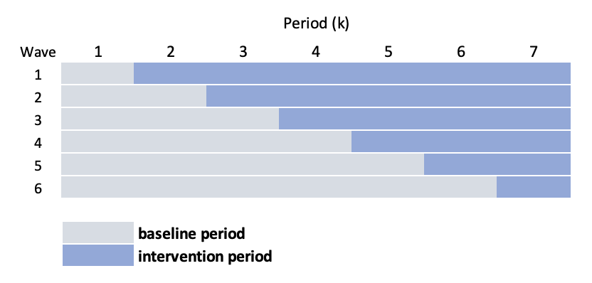
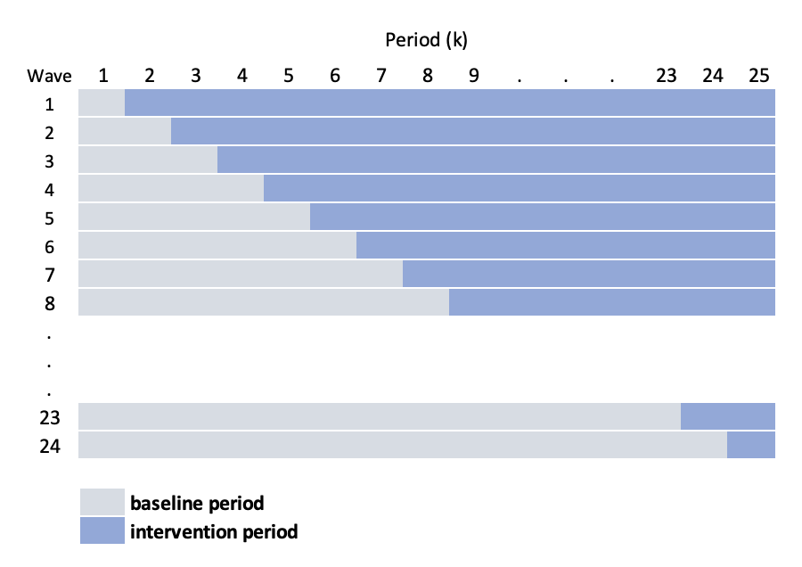

[Recently](https://www.rdatagen.net/post/2022-11-01-modeling-secular-trend-in-crt-using-gam/){target="_blank"} I started a discussion about modeling secular trends using flexible models in the context of a cluster randomized trial. My explorations on this topic are motivated by a cluster randomized trial using a stepped-wedge study design that I am involved with. The first post focused on more standard parallel designs; here, I want to extend the discussion explicitly to stepped-wedge designs.

### The stepped-wedge design

Stepped-wedge designs are a special class of cluster randomized trial where each cluster is observed in both treatment arms (as opposed to the classic parallel design where only some of the clusters receive the treatment). This is a special case of a cross-over design, where the cross-over is only in one direction: control (or pre-intervention) to intervention. I've written about this in a number of different contexts (for example, with respect to [power analysis](https://www.rdatagen.net/post/alternatives-to-stepped-wedge-designs/), [complicated ICC patterns](https://www.rdatagen.net/post/intra-cluster-correlations-over-time/), [using Bayesian models for estimation](https://www.rdatagen.net/post/bayes-model-to-estimate-stepped-wedge-trial-with-non-trivial-icc-structure/ ), [open cohorts](https://www.rdatagen.net/post/simulating-an-open-cohort-stepped-wedge-trial/), and [baseline measurements to improve efficiency](https://www.rdatagen.net/post/2021-12-07-exploring-design-effects-of-stepped-wedge-designs-with-baseline-measurements/)), and I won't give too much background.

In a typical stepped-wedge design (if there is such a thing), groups of sites (considered waves) is randomized to intervention starting times. For example, if there are 24 sites divided into 6 waves (so 4 sites per wave), there will be six starting times and 7 measurement periods (if we want to have at least one baseline/control period for each wave, and at least one intervention period per wave). Schematically, the design looks like this:

{width=75%}

We could use a linear mixed effects model to estimate the intervention effect $\delta$, which might look like this:

$$
Y_{ijk} = a_{j} + \beta_{k} + \delta A_{jk} + e_{ijk}
$$

where $Y_{ijk}$ is the (continuous) outcome of individual $i$ in cluster $j$ during time period $k$. $a_j$ is the random intercept for site $j$, and we assume that $a_j \sim N(0, \sigma^2_a)$. $A_{jk}$ is the intervention indicator for site $j$ during time period $k$. $\beta_k$ is a period-specific effect. And $e_{ijk}$ is the individual level effect.

In the study that is motivating all of this, the situation is different in a key way.The intervention can only be implemented at one site a time (so that the number of waves equals the number of sites), leading to this alternative schematic:

{width=75%}

The challenge under this scenario, is that $k$ (the number of periods) is starting to get quite large, requiring us to estimate a large number of period specific effects $\beta_k$. In addition, the periods are actually shorter, so we have less information available to estimate those period effects. An alternative approach, as you may have anticpated, is to smooth the secular trend, using a model that looks like this:

$$
Y_{ijk} = a_{j} + s(k) + \delta A_{jk} + e_{ijk}
$$

where $s(.)$ is a smooth function of time. We can take this one step further and specify a site-specific smoothing function $s_j(.)$:

$$
Y_{ijk} = a_{j} + s_j(k) + \delta A_{jk} + e_{ijk}
$$

So, we will use either splines or generalized additive models to estimate the curve, which will allow us to control for the period effect. By smoothing the function, we are assuming that the measurements closer in time are more highly correlated that measurements further apart.

Now, I'll describe the data generation process and then fit some models.

### Data generation process

$$
Y_{ijk} = a_{j} + b_{jk} + \delta A_{jk} 
$$
$$ 
a_j \sim N(0, \sigma^2_a) \\
b_{jk} \sim N(0, \Sigma_b) \\
d_j \sim N(0, \sigma^2_d)
$$

```{r, message=FALSE}
library(simstudy)
library(ggplot2)
library(data.table)
library(mgcv)
library(lme4)
library(splines)
library(gamm4)
```


```{r}
def <- defData(varname = "a", formula = 0, variance = 9)
def <- defData(def, varname = "d", formula = 0, variance = 2)
def <- defData(def, varname = "mu", formula = 0, dist = "nonrandom")
def <- defData(def, varname = "s2", formula = 16, dist = "nonrandom")

defOut <- defDataAdd(varname = "y", 
  formula = "a + b + A * (5 + d)", 
  variance = 40)
```

```{r}
set.seed(1234)

dd <- genData(24, def, id = "site")
dd <- addPeriods(dd, 30, "site", perName = "k")

dd <- addCorGen(dtOld = dd, idvar = "site", 
  rho = .6, corstr = "ar1",
  dist = "normal", param1 = "mu", param2 = "s2", cnames = "b")

dd <- trtStepWedge(dd, "site", nWaves = 24, lenWaves = 1, startPer = 3, 
  grpName = "A", perName = "k")

dd <- genCluster(dd, "timeID", numIndsVar = 30, level1ID = "id")
dd <- addColumns(defOut, dd)

dd$site <- as.factor(dd$site)
dd[, normper := (k - min(k))/(max(k) - min(k))]
```


```{r, echo = FALSE, fig.width = 9, fig.height = 4}
ggplot(data = dd, aes(x = k, y = y)) +
  geom_point(aes(color = factor(A, labels = c("Control", "Intervention"))), 
             size = 0.1) +
  scale_color_manual(values = c("#d07b7c", "#7ba7d0")) +
  facet_wrap(~site, ncol = 8) +
  theme(panel.grid = element_blank(),
        legend.title = element_blank(),
        axis.text = element_text(size = 7),
        strip.text = element_text(size = 8)) +
  xlim(c(0,30)) +
  guides(color = guide_legend(override.aes = list(size = 2)))
```