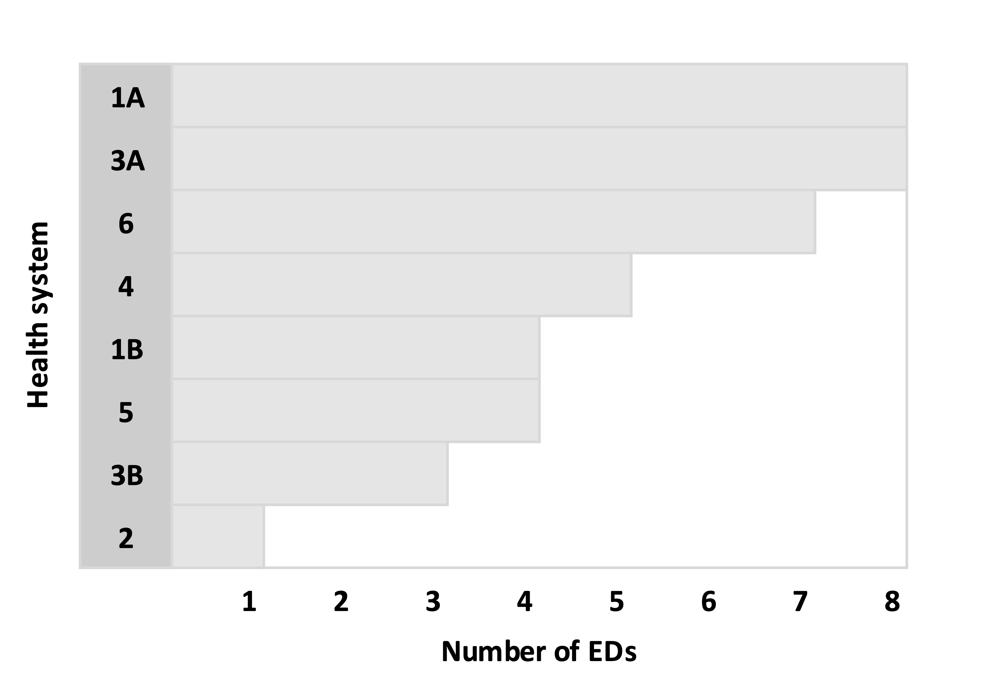
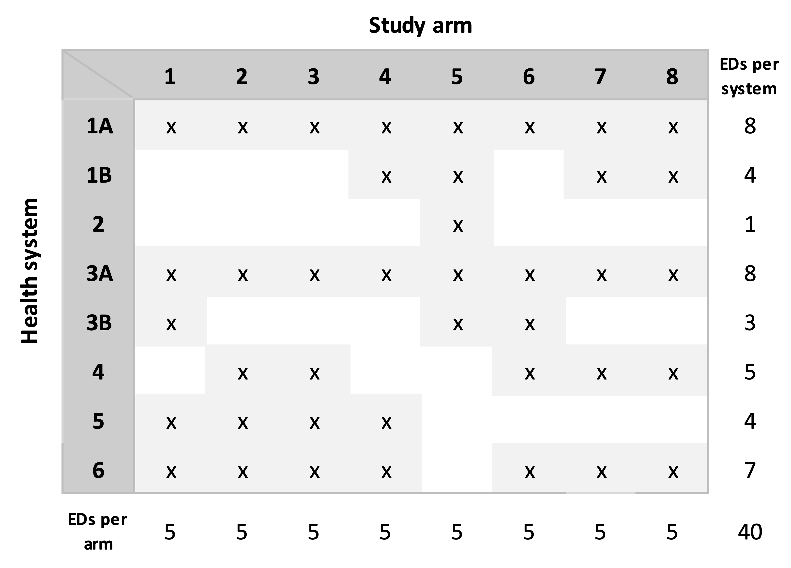

Over two years ago, I wrote a series of posts (starting [here](https://www.rdatagen.net/post/2021-09-28-analyzing-a-factorial-trial-with-a-bayesian-model/){target="_blank"}) that described possible analytic approaches for a proposed cluster-randomized trial with a factorial design. That proposal was recently funded by NIA/NIH, and now the *Emergency departments leading the transformation of Alzheimer's and dementia care* (ED-LEAD) trial is just getting underway. Since the trial is in its early planning phase, I am starting to think about how we will do the randomization, and I'm sharing some of those thoughts (and code) here.

### A brief overview of ED-LEAD

The ED-LEAD study is evaluating a set of three independent yet potentially synergistic interventions all targeted at improving the healthcare of persons living with dementia (PLWD) and their caregivers. The target population is patients 66 and older with a diagnosis of dementia who come to the Emergency Department (ED) but are discharge home. The common thread linking the three interventions -- an emergency care redesign, community paramedicine, and nurse-telephonic care -- is the particular focus of each on PLWD who have gone to the Emergency Department (ED) for care.  The primary outcome is whether a patient has a subsequent ED visit within 30 day.

Currently, a total of 14 health systems are participating in the study, with each system contributing between 1 and 12 EDs, for a total of 80 EDs. The proposed randomization structure is based on the *factorial* design, where an ED will be randomized to any combination of the three interventions: (1) *none*, (2) *a* only, (3) *b* only, (4) *c* only, (5) *a + b*, (6) *a + c*, (7) *b + c*, and (8) *a + b + c*. A key challenge, which I am focusing on here, is how to randomize 16 EDs to each of the 8 arms while at the same time stratifying by health system. (Another challenge is how ensure decent balance of ED-level characteristics, such as patient volume or location, across the arms; for that, we'll be using constrained randomization, which I [wrote](https://www.rdatagen.net/post/2020-12-22-constrained-randomization-to-evaulate-the-vaccine-rollout-in-nursing-homes/){target="_blank"} about quite a few years ago.)

### The randomization algorithm

In the presentation of the algorithm, I am simplifying a bit, assuming there are eight arms, but only six health systems, and 40 total EDs. Since we have 40 EDs and eight arms, our target is a random allocation that has exactly five EDs per arm.

In our simplified example, this is the distribution of the number of EDs across the health systems:
{height=300px, width=600px}

(1) *Split health systems with more than eight EDs into smaller subgroups.* For each health system that has more than eight EDs, randomly select eight EDs from the health system to create a subgroup *A* and the remainder go in group *B*. If group *B* still has more than eight EDs, split those into *B* and *C*, and continue the process until the last subgroup has fewer than eight EDs. In the example, *Health System (HS) 1* has 12 EDs, so we create subgroups *1A* and *1B*. Likewise, *HS 3* is split into two subgroups:
{height=300px}

(2) *Sort the health systems (including the subgroups) in descending order by number of EDs*:
{height=300px}


(3) *Sequentially make random allocations for each health system.* Now we are at the heart of the algorithm. Each system or subgroup with eight EDs will be assigned all eight arms. So, *HS 1A* and *HS 3A* will each be allocated all eight arms. For each health system with fewer than eight EDs, *K* arms are sampled without replacement, where *K* is the number of EDs in the health system or subgroup. In the example below, *HS 2* has seven EDs, so seven arms are selected at random. The process is repeated for each health system in descending order based on the number of EDs, with one key modification as we progress down the list: at some point, we will reach the maximum number of EDs for an arm, so that arm must be removed from the possible arms for the subsequent health systems. In the example, after the arms for *HS 1B* have been determined (the fifth iteration of the sequence), arms **7** and **8** have been allocated to five health systems; since the limit has been reached, these two arms are no longer available for the three remaining health systems. When we get to the final health system (*HS 5*) that has only one ED, there is only a single arm available, since all the other arms have been allocated to five health systems.
{height=300px}
(4) *Re-sort the assignment matrix.* This sorting needs to happen so that we can merge the allocations with the actual EDs in each health system:
{height=300px}

(5) *Assign specific EDs in each health system to the treatment arms that have been allocated.* For each health system (or subgroup), sample with replacement all of the EDs to create a random ordering. The treatment arm assignments allocated to the health system are made in the order of this ordering. In the case of *HS 1A* in our example, the first sampled ED is assigned to treatment arm **1**, the second to arm **2**, etc., all the way until the ED that was sampled eighth, which is assigned to arm **8**. In the case of *HS 3B*, there are only three EDs; the first sampled is assigned to arm **1**,  the second ED is assigned to arm **5**, and the third to arm **6**.

In practice, we could call it a day once the assignments have been made, but the case of ED-LEAD, we are still concerned about the balance of ED characteristics across the arms. This will be accomplished using constrained randomization, which involves generating a large number (say 500K  or 1M) of possible random allocations. We will evaluate the balance for each one with respect to the desired characteristics in order to create a set of possible balanced random allocations. (This possible set will likely be a very small subset of all the generated allocations, which is why we need such a large pool.) The final random allocation will be a random selection from the subset of balanced allocations. (In the code that follows, I have *not* included this step.)

### The R implementation

The implementation of the algorithm in `R` follows. First, we load the necessary libraries.

```{r}
set.seed(12345)

library(data.table)
library(simstudy)
```

The number of arms is set to eight, and the number of EDs for each of the six health systems is also specified. As in the example above, there are 40 total EDs:

```{r}
n_arms <- 8
n_eds = c(12, 1, 11, 5, 4, 7) 

```

In this chunk of code, we are randomly sorting the EDs within each health system and splitting the large health systems into subgroups with a maximum eight EDs.

```{r}
dd.hs <- data.table(hsid = 1:length(n_eds), N = n_eds )
dd.ed <- genCluster(dd.hs, "hsid", "N", "id")

n_groups <- ceiling(n_eds / n_arms)

dd.split <- data.table()

for (i in seq_along(n_groups)) {
  eds <- dd.ed[hsid == i, id]
  n_to_samp <- min(8, dd.ed[hsid == i, .N])
  for (j in 1:n_groups[i]) {
      
    if (length(eds) > 1) sample_eds <- sample(eds, n_to_samp)
    else sample_eds <- eds
      
    dd.split <- rbind(dd.split, data.table(hs = i, group = j, ed = sample_eds) ) 
    eds <- eds[!(eds %in% sample_eds)]
    n_to_samp <- min(8, length(eds))
  }
}
  
dd.split[, ed_index := 1:.N, keyby = .(hs, group)]
dd.hs <- dd.split[, .N, keyby = .(hs, group)][, hs_index := .I][]
dd.split <- merge(dd.split, dd.hs, by = c("hs", "group"))
```

Here is *HS 1* that has been split into two groups, one with eight EDs and the second with one. Note that the EDs have been randomly sorted and randomly assigned to the two subgroups.

```{r}
dd.split[hs == 1]
```

The arms for each health system (or subgroup if a health system has been divided into smaller groups) are generated here. However, before arms are sampled for a particular group, the arms that have previously reached the threshold of five EDS are removed from the list of possible arms:

```{r}
n_per_arm <- dd.hs[, sum(N)] / n_arms
  
dd.hs <- dd.hs[order(-N)]
n_eds <- copy(dd.hs$N)
  
dd.hs[, ed_index := .I ]
setkey(dd.hs, hs_index)

A <- 1:n_arms
mat.assign <- matrix(0, nrow = length(n_eds), ncol = n_arms)
  
for (i in seq_along(n_eds)) {
  
  # keeping only arms that haven't reached threshold
  
  B <- A[apply(mat.assign, 2, sum) < n_per_arm] 
  
  if (length(B) == 1) {       # only one possible arm remains
    
    mat.assign[i, B] <- 1
    
  } else {                    # multiple arms remain
    
    a <- sample(B, n_eds[i], replace = FALSE)
    mat.assign[i, a] <- 1
    
  }
}

mat.assign <- mat.assign[dd.hs$ed_index,] # sorted in the original order
```

In the assignment matrix, each row represents a health system or group, and each column represents each possible treatment arm. A value of 1 in each column indicates that treatment arm has been allocated to a health system. For systems or subgroups with eight EDs, all of the arms are allocated:

```{r}
mat.assign
```

Confirming that the number of arms per system and the number of EDs per arm are both correct:

```{r}
apply(mat.assign, 1, sum) # number of arms per system or subgroup
apply(mat.assign, 2, sum) # number of EDs per arm
```

The final step is to apply the assignment matrix to the list of EDs, which is done by vectorizing the matrix and then merging with the list of EDs.

```{r}
rownames(mat.assign) <- 1:nrow(mat.assign)
colnames(mat.assign) <- 1:ncol(mat.assign)

dd.assign <- data.table(as.table(mat.assign)) # vectorize
dd.assign <- dd.assign[N == 1]
  
dd.assign <- dd.assign[, .(hs_index = V1, arm = V2)]
dd.assign[,`:=`(hs_index = as.numeric(hs_index), arm = as.numeric(arm))]
  
setkey(dd.assign, hs_index)
dd.assign[, ed_index := 1:.N, keyby = hs_index]
  
dd.assign <- merge(dd.assign, dd.split, by = c("hs_index", "ed_index"))
  
dd.assign <- dd.assign[, .(hs, group, ed, arm)]
setkey(dd.assign, ed)
```

The treatment assignments for HS **1**:

```{r}  
dd.assign[hs == 1]
```

### Verifying the algorithm works

A randomization protocol is only valid to the extent that each unit of randomization (in the case, the ED) has equal probability of being assigned to any of the arms. Since we have eight arms, we should expect that each ED has a probability of 0.125 (1\8) of getting randomized to each arm. 

In addition, within each health system, we expect that each arm has equal probability of being assigned; the probability is a function of the number of EDs in the health system. The expected rate (over repeated random allocations) for an arm in a particular health system is the number of EDs divided by eight. For example, we would expect the rates for *HS 1* to be 1.5 (12/8).

These hypothetical probabilities can be checked by generating a large number of possible random allocations and evaluating the empirical probabilities. I have generated 50,000 possible random allocations. (I haven't included the code as it is really just an adaptation of the code above.)

The probabilities for the first six EDs are shown below, one row for each ED. In every case, the probability of a particular ED getting assigned to one of the arms was quite close to the expected value of 0.125. (The results for the other EDs, not included here for brevity, are consistent with these.) 

```{r, echo=FALSE}
load("data/probs.Rdata")
head(probs)
```

The averages at the health system level are show next. Each row represents a health system (*1* through *6*), showing the rate of an arm getting allocated to the health system. The theoretical rates for each of the six health systems are $12/8 = 1.500$, $1/8 = 0.125$, $11/8 = 1.375$, $5/8 = 0.625$, $4/8 = 0.500$, and $7/8 = 0.875$, respectively. We are looking to see if the rates are consistent across the arms for a particular health system, and that they are close to the theoretical value. It appears that they are:

```{r, echo=FALSE}
rates
```

<p><small><font color="darkkhaki">
Support:

This work was supported in part by the National Institute on Aging (NIA) of the National Institutes of Health under Award Number U19AG078105, which funds the *Emergency departments leading the transformation of Alzheimer's and dementia care* (ED-LEAD) study. The author, the leader of the Statistics Analysis Core, was the sole writer of this blog post and has no conflicts. The content is solely the responsibility of the author and does not necessarily represent the official views of the National Institutes of Health.
</font></small></p>


