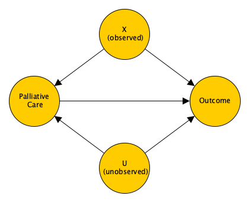
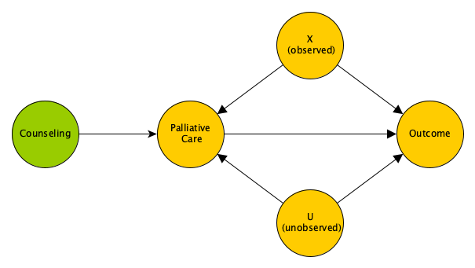

An investigator I frequently consult with seeks to estimate the effect of a palliative care treatment protocol for patients nearing end-stage disease, compared to a more standard, though potentially overly burdensome, therapeutic approach. Ideally, we would conduct a two-arm randomized clinical trial (RCT) to create comparable groups and obtain an unbiased estimate of the intervention effect. However, in this case, it may be considered unethical to randomize patients to a non-standard protocol.

Alternatively, we could conduct an observational study, measuring outcomes for patients who choose one of the two protocols. This approach would yield unbiased estimates only if we could collect all relevant data to ensure the absence of unmeasured confounding. While such an analysis could be useful, it’s uncertain whether we could convincingly argue that the estimates are truly unbiased, though we might assess their sensitivity to unmeasured confounding.

A potential middle ground involves randomizing in a way that merely increases the likelihood that a patient will choose the palliative care protocol. If successful, this could allow us to estimate a specific causal effect—the Complier Average Treatment Effect (CATE). The CATE might offer valuable insights into the relative merits of the two approaches. The key advantage of this approach is that it enables an unbiased estimate of the CATE, even in the presence of unmeasured confounding.

My goal here is to introduce you to this instrumental variable (IV) design and present simulations that demonstrate its potential strengths. IV analysis is a widely used estimation method across various fields, including economics, sociology, and epidemiology.

### Observational study with no unmeasured confounding

The directed acyclic graph (DAG) below represents an observational dataset with two predictors, $X$ and $U$, where only $X$ is measured. In this scenario, we can estimate the average treatment effect by fitting a regression model that adjusts for $X$, assuming $X$ is equally distributed across the palliative care and standard therapy groups. Although UU, the unmeasured covariate, predicts the outcome, it does not predict the selected protocol. Therefore, UU is not a confounder and does not need to be included in the model to ensure an unbiased estimate.

 {width=50%}

The data definitions for the simulation follow from the DAG. In the simulation, the variable $b$ is the association between $U$ and the chosen protocol. In this first case, $b$ will be set to zero so that $U$ is only a predictor of the outcome, but not the protocol. In the data generation, we generate potential outcomes $Y^0$ and $Y^1$ for each individual. These are the outcomes we would observe for the same individual if they receive the standard therapy or the palliative care protocol, respectively. The causal effect at the individual level is $Y^1 - Y^0$. (I've discussed causal inference elsewhere - for example, [here](https://www.rdatagen.net/post/potential-outcomes-confounding/){target="_blank"}, [here](https://www.rdatagen.net/post/dags-colliders-and-an-example-of-variance-bias-tradeoff/){target="_blank"}, and [here](https://www.rdatagen.net/post/generating-data-to-explore-the-myriad-causal-effects/){target="_blank"}. If you want a really good guide - and even includes a chapter on IV - you can't really do any better than the book [*Causal Inference: What If*](https://www.hsph.harvard.edu/miguel-hernan/causal-inference-book/){target="_blank"} by Hernán and Robins and available online.) The observed outcome $Y$ is the potential outcome for the protocol actually selected. In this case (and all the others that follow), I assume a treatment effect of 2 (with some variation across individuals.)

Here are the necessary libraries for all the simulations that follow and then the data definitions just described:

```{r, message=FALSE}
library(simstudy)
library(data.table)
library(broom)
library(AER)
```

```{r}
def <-
  defData(varname = "X", formula = 0, variance = 1, dist = "normal") |>
  defData(varname = "U", formula = 0, variance = 1, dist = "normal") |>
  defData(varname = "P", formula = "-1 + .2*X + ..b*U", dist = "binary", link="logit") |>
  defData(varname = "Y0", formula = "X + U", variance = 16, dist = "normal") |>
  defData(varname = "Y1", formula = "2 + Y0", variance = 0.75, dist = "normal") |>
  defData(varname = "Y", formula = "(P==0)*Y0 + (P==1)*Y1", dist = "nonrandom")
```

I'm generating a large sample to reduce sample variability:

```{r}
set.seed(9434)

b <- 0
dd <- genData(10000, def)
dd
```

The true average casual effect is close to two, as expected. This is something we cannot observe:

```{r}
dd[, mean(Y1 - Y0)]
```

If we estimate a linear model adjusting for $X$, the parameter for $P$ should also be close to two, which it is:

```{r}
tidy(lm(Y ~ P + X, data = dd))
```

### Observational study *with* unmeasured confounding

The DAG below now has an arrow pointing from $U$ to the protocol, so $b$ is non-zero. If we are not able to measure $U$ and control for it in the model, we will get a biased estimate of the treatment effect.

 {width=50%}

In this case, the unobserved average causal effect is still very close to two.

```{r}
set.seed(9434)

b <- 0.2
dd <- genData(10000, def)

dd[, mean(Y1 - Y0)]
```

However, if we fit a model without accounting for the unmeasured confounder $U$, we get a biased (upward) estimate for the effect of the palliative care protocol:

```{r, echo = FALSE}
tidy(lm(Y ~ P + X, data = dd))
```

Adjusting for $U$ removes the bias, though this would not be possible if we could not measure $U$:

```{r, echo = FALSE}
tidy(lm(Y ~ P + X + U, data = dd))
```

### IV design

Since we don't believe it’s possible to measure all potential confounders, nor do we think conducting a standard RCT is appropriate or feasible, we might want to consider a design that randomizes patients to a setting where they are more likely to choose palliative care over the standard protocol. By establishing a counseling program that encourages patients to opt for palliative care when appropriate, we can use the variation in treatment decisions to estimate a causal effect. Crucially, patients in both the counseling and non-counseling arms can choose either palliative care or the standard protocol; the expectation is that those in the counseling arm will be more likely to choose palliative care.

It’s important to be clear that our interest lies in the effect of palliative care versus the standard protocol, not in the counseling program itself. A direct comparison between the counseling and non-counseling groups would not provide the information we need, as each group is likely to include patients receiving both types of care. Therefore, such a comparison would be ambiguous. Moreover, if we compare palliative care and standard protocol within the counseling arm, we face the same issue of unmeasured confounding as in a purely observational study.

Additionally, comparing patients who opt for palliative care in the counseling arm with those who choose the standard protocol in the non-counseling arm could lead to problems. Some patients in the non-counseling arm may have chosen standard care regardless of their group assignment, making them poor counterfactuals for those in the counseling arm who opted for palliative care. Similarly, some patients in the counseling arm who chose palliative care might have done so even without counseling, so including them in a comparison with non-counseling patients who opted for standard care may not be meaningful.

This situation illustrates a taxonomy of patient behavior essential to instrumental variable (IV) analysis, known as principal stratification. In this framework, patients can be categorized as *never-takers* (those who choose standard care regardless of their assignment), *always-takers* (those who choose palliative care regardless), or *compliers* (those who choose standard care in the non-counseling arm but opt for palliative care in the counseling arm). There is also a fourth category, deniers, which we assume does not exist.

In IV analysis, we compare the compliers across arms, effectively sidestepping the never-takers and always-takers. Although we can’t definitively classify individual patients as compliers or never-takers, we assume that a patient in the non-counseling arm who chooses palliative care is an always-taker. Similarly, we assume that a patient in the counseling arm who opts for standard care would have done so even without counseling.

The instrument in IV analysis is the characteristic or assignment that induces differential distributions of the exposures of interest. In this case, the instrument is the assignment to counseling or not, and the exposure of interest is palliative care vs. the standard protocol. The target estimand in IV analysis is the *complier average treatment effect* or CATE. CATE can be estimated using IV analysis under a set of four key assumptions. First, we assume monotonicity of behavior - so that there are never-takers, always-takers, and compliers, but no deniers. Second, the instrument must be uncorrelated with the error term of the IV model. Third, the instrument can have no direct effect on the outcome of interest (that is, the effect is only induced through the exposure of interest). Fourth, the instrument must be correlated with the exposure of interest. This means that the probability of choosing palliative care will be different in the counseling and non-counseling arms.

The instrument in IV analysis is the characteristic or assignment that induces different distributions of the exposures of interest—in this case, the assignment to counseling or not, with the exposure of interest being palliative care versus the standard protocol. The target estimand in IV analysis is the Complier Average Treatment Effect (CATE). CATE can be estimated using IV analysis under four key assumptions:

* **Monotonicity**: There are never-takers, always-takers, and compliers, but no deniers.
* **Independence**: The instrument must be uncorrelated with the error term of the IV model.
* **Exclusion Restriction**: The instrument can have no direct effect on the outcome of interest; its effect must be solely through the exposure of interest.
* **Relevance**: The instrument must be correlated with the exposure of interest, meaning the probability of choosing palliative care differs between the counseling and non-counseling arms.

Here is the DAG that represents the last three assumptions (but not the monotinicity assumption):

{width=75%}

The simulation for this scenario is a little more involved, because we need to generate outcomes depending on the stratum an individual falls in, and we need to generate the palliative care exposure differentially. The way I have implemented this is to generate $P^0$, the potential exposure assuming an individual is randomized not to receive counseling. The probability of opting for palliative care is very low, less than 10\%:

```{r}
def_p0 <-
  defData(varname = "A", formula = "1;1", dist = "trtAssign") |>
  defData(varname = "X", formula = 0, variance =1, dist = "normal") |>
  defData(varname = "U", formula = 0, variance =1, dist = "normal") |>
  defData(varname = "P0", formula = "-2.5 + 0.2*X + 0.2*U", dist = "binary", link="logit")

set.seed(7271)

dd <- genData(10000, def_p0)
dd

dd[, mean(P0)]
```

Next we generate $P^1$, the potential exposure when randomized to counseling.

```{r}
def_p1 <-
  defCondition(
    condition = "P0 == 0", 
    formula = "0.5 + X + U", 
    dist = "binary", 
    link = "logit"
  ) |>
  defCondition(
    condition = "P0 == 1", 
    formula = 1, 
    dist = "nonrandom"
  )

dd <- addCondition(def_p1, dd, newvar = "P1")
dd
```

The probability of choosing palliative care is much higher under counseling (and is in fact 100\% when $P^0 = 1$):

```{r}
dd[, mean(P1), keyby = P0]
```

This next step is a little less intuitive. I'm first generating interim potential outcomes $Q^0$ (for $Y^0$) and $Q^1$ (for $Y^1$). $Q^0$ depends on $X$ and $U$, and $Q^1$ is centered around $2 + Q^0$. The actual potential outcomes $Y^0$ and $Y^1$ depend on the status of $P^0$ and $P^1$, respectively. If $P^0 = 0$ then $Y^0$ takes on the value of $Q^0$, but if  $P^0 = 1$ then $Y^0$ takes on the value of $Q^1$. The same logic defines $Y^1$.


```{r}
def_A <-
  defDataAdd(varname = "Q0", formula = "X + U", variance = 16, dist = "normal") |>
  defDataAdd(varname = "Q1", formula = "2 + Q0", variance = 0.75, dist = "normal") |>
  defDataAdd(varname = "Y0", formula = "Q0*(P0==0) + Q1*(P0==1)", dist = "nonrandom") |>
  defDataAdd(varname = "Y1", formula = "Q0*(P1==0) + Q1*(P1==1)", dist = "nonrandom") |>
  defDataAdd(varname = "P", formula = "(A==0)*P0 + (A==1)*P1", dist = "nonrandom") |>
  defDataAdd(varname = "Y", formula = "(P==0)*Y0 + (P==1)*Y1", dist = "nonrandom")

dd <- addColumns(def_A, dd)
dd[, .(A, P0, P1, P, Q0 = round(Q0, 2), Q1 = round(Q1, 2), 
       Y0 = round(Y0, 2), Y1 = round(Y1, 2), Y = round(Y, 2))]
```

This data generating process forces the causal effect of palliative care to be zero for never-takers and always-takers, and averages 2 for compliers.

```{r}
dd[, mean(Y1 - Y0), keyby = .(P0, P1)]
```

A model that adjusts for observed covariates only will provide a biased estimate for the effect of palliative care (in this case, leading to an overestimate):

```{r}
tidy(lm(Y ~ P + X, data = dd))
```

However, if we are able to measure and adjust for all covariates, we will get an unbiased estimate:

```{r}
tidy(lm(Y ~ P + X + U, data = dd))
```

Although we cannot actually measure $U$ (i.e., it is not observed), we can use IV estimation to get an unbiased estimate of the CATE. Note that $A$ is introduced into the regression equation:

```{r}
tidy(ivreg(Y ~ P + X  |  A + X, data = dd))
```

To get a more robust assessment of the analytic methods, I've conducted a simple experiment that generates 1000 smaller data sets of 500 individuals each. For each generated data set, I am recording

1. **overall_po**: average overall causal effect of never-takers, always-takers, and compliers combined based on the unobserved potential outcomes
2. **complier_po**: compliers-only causal effect based on the potential outcomes 
3. **overall**: overall observed effect without any adjustment
4. **within**: comparison of palliative care vs the standard protocol for patients who received counselling
5. **cross**: comparison of patients who received counseling and opted for palliative care with patients who did not receive counseling and received the standard protocol
6. **lm_x**: estimated effect adjusting for $X$ alone 
7. **lm_xu**: estimated effect adjusting for both $X$ and $U$
8. **iv**: IV estimate

```{r}
gen_ests <- function(n) {
  
  dd <- genData(n, def_p0)
  dd <- addCondition(def_p1, dd, newvar = "P1")
  dd <- addColumns(def_A, dd) 
  
  overall_po <- dd[,mean(Y1-Y0)]
  
  dx <- dd[P0 == 0 & P1 == 1]
  complier_po <- dx[,mean(Y1-Y0)]
  
  overall <- dd[P == 1, mean(Y)] - dd[P == 0, mean(Y)]
  within <- dd[P == 1 & A == 1, mean(Y)] - dd[P == 0 & A == 1, mean(Y)]
  cross <- dd[P == 1 & A == 1, mean(Y)] - dd[P == 0 & A == 0, mean(Y)]
  
  lm_x <- coef(lm(Y ~ P + X, data = dd))["P"]
  lm_xu <- coef(lm(Y ~ P + X + U, data = dd))["P"]
  
  iv <- coef(ivreg(Y ~ P + X  |  A + X, data = dd))["P"]
  
  data.table(overall_po, complier_po, overall, within, cross, lm_x, lm_xu, iv)
  
}

res <- rbindlist(lapply(1:1000, function(x) gen_ests(500)))
```

Below, the means and standard deviations of the estimates across all 1000 iterations are shown. As expected, all estimates are biased except for the complier average treatment effect based on the potential outcomes, the linear model adjusting for both $X$ and $U$, and the IV estimate:

```{r}
lapply(res, function(x) c( round(mean(x), 2), round(sd(x), 2) ))
```

### Caveats

While IV estimation works well in this idealized setting, there are some key limitations worth noting. First, consider the Complier Average Treatment Effect (CATE). Is the CATE truly what we are interested in? If most patients are compliers, then perhaps it is, but if they represent only a small proportion of the population, the usefulness of the information becomes less clear. We are likely more interested in understanding the effect of an approach that will be acceptable to a significant portion of eligible patients. The size of this "significant portion" will depend on the context—perhaps 25\% is sufficient in some cases, while in others, we may require closer to 75\%.

The second issue is the assumption that counseling has no direct effect on the outcome. Although I’ve been vague about the outcome in question, it’s crucial to choose an outcome carefully to ensure that the act of receiving counseling, independent of the protocol selected, does not influence the outcome. If this assumption is violated, the IV estimate will no longer be unbiased for the CATE.

<p><small><font color="darkkhaki">
Reference:

Hernán MA, Robins JM (2020). Causal Inference: What If. Boca Raton: Chapman & Hall/CRC.
</font></small></p>
