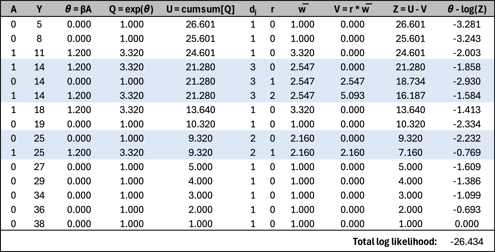

Over my past few posts, I’ve been progressively building towards a Bayesian model for a stepped-wedge cluster randomized trial with a time-to-event outcome, where time will be modeled using a spline function. I started with a simple Cox proportional hazards model for a traditional RCT, ignoring time as a factor. In the next post, I introduced a nonlinear time effect. For the third post—one I initially thought was ready to publish—I extended the model to a cluster randomized trial without explicitly incorporating time. I was then working on the grand finale, the full model, when I ran into an issue: I couldn’t recover the effect-size parameter used to generate the data.

After an embarrassingly long debugging process, I finally realized the problem—many events shared the same event times, and my model failed to account for ties. This issue hadn’t been apparent in the earlier models, but the final version was particularly sensitive to it. So, I decided to step back and first implement a model that properly handles ties before moving ahead.

This [set of lecture notes](https://www.google.com/url?sa=t&source=web&rct=j&opi=89978449&url=https://myweb.uiowa.edu/pbreheny/7210/f15/notes/11-5.pdf){target="_blank"} prepared by Patrick Breheny provides a nice explanation of algorithms for handling tied survival times.

$$
\log L(\beta) = \sum_{j=1}^{J} \left[ \sum_{i \in D_j} x_i^\top \beta - \sum_{r=0}^{d_j-1} \log \left( \sum_{k \in R_j} \exp(x_k^\top \beta) - r \cdot \bar{w} \right) \right] \\
$$

* $D_j$: set of individuals (or observations) that experience an event at time $t_j$ (i.e., the event time for the $j^\text{th}$ event).
* $R_j$: risk set at time $t_j$, which includes all individuals who are still at risk (i.e., those who have not yet experienced the event and are still being followed at $t_j$).
* $d_j$: the number of individuals who experience the event at time $t_j$.
* $r$ ranges from 0 to $d_j - 1$, where $d_j$ is the number of events at time $t_j$.

And 

$$
\bar{w} = \frac{1}{d_j} \sum_{i \in D_j} \exp(x_i^\top \beta)
$$

```{r, echo=FALSE, out.width="90%"}

```


```{r, message=FALSE}
library(simstudy)
library(data.table)
library(survival)
library(survminer)
library(cmdstanr)
```

```{r}
#### Simulation

def <- defData(varname = "A", formula = "1;1", dist = "trtAssign")

defS <-
  defSurv(
    varname = "timeEvent",
    formula = "-11.6 + ..delta_f * A",
    shape = 0.30
  )  |>
  defSurv(varname = "censorTime", formula = -11.3, shape = .35)

## Parameters

delta_f <- log(1.5)

##### Generate single data set #####

set.seed(7398)

dd <- genData(1000, def)
dd <- genSurv(dd, defS, timeName = "Y", censorName = "censorTime", digits = 0,
              eventName = "event", typeName = "eventType", keepEvents  = TRUE)

```


```{r km_plot, echo=FALSE, fig.width = 6, fig.height = 4}
library(ggplot2)

dd_surv <- survfit(Surv(Y, event) ~ A, data = dd)
dd_surv_tidy <- data.table(surv_summary(dd_surv, data = dd))
dd_censor <- dd_surv_tidy[n.censor > 0, ]

ggplot(dd_surv_tidy, aes(time, surv, color = factor(A))) +
  geom_step() +  # Kaplan-Meier curves
  geom_point(data = dd_censor, aes(time, surv), shape = 3, size = 1, color = "black")  +
  labs(x = "Time to event", y = "Probability of no event") +
  theme(panel.grid = element_blank(), legend.position = "none") 

```


```{r}
stan_code <-
"
data {

  int<lower=0> N_o;        // Number of uncensored observations
  array[N_o] int i_o;      // Index in data set

  int<lower=0> N;          // Number of total observations
  vector[N] x;             // Covariates for all observations
  
  array[N] int index;
  
  int<lower=0> T;            // Number of records as ties
  int<lower=1> G;            // Number of groups of ties
  array[T] int t_grp;        // Indicating tie group
  array[T] int t_index;      // Index in data set
  vector[T] t_adj;           // Adjustment for ties (efron)
}

parameters {
  
  real beta;          // Fixed effects for covariates

}

model {
  
  // Prior
  
  beta ~ normal(0, 4);
  
  // Calculate theta for each observation to be used in likelihood
  
  vector[N] theta;
  vector[N] log_sum_exp_theta;
  vector[G] exp_theta_grp = rep_vector(0, G);
  
  int first_in_grp;
  
  for (i in 1:N) {
    theta[i] = x[i] * beta;  
  }

  // Computing cumulative sum of log(exp(theta)) from last to first observation
  
  log_sum_exp_theta[N] = theta[N];
  
  for (i in tail(sort_indices_desc(index), N-1)) {
    log_sum_exp_theta[i] = log_sum_exp(theta[i], log_sum_exp_theta[i + 1]);
  }
  
  // Adjusting cumulative sum for ties
  
  for (i in 1:T) {
    exp_theta_grp[t_grp[i]] += exp(theta[t_index[i]]);
  }

  for (i in 1:T) {
  
    if (t_adj[i] == 0) {
      first_in_grp = t_index[i];
    }

    log_sum_exp_theta[t_index[i]] =
      log( exp(log_sum_exp_theta[first_in_grp]) - t_adj[i] * exp_theta_grp[t_grp[i]]);
  }
  
  // Likelihood for uncensored observations

  for (n_o in 1:N_o) {
    target += theta[i_o[n_o]] - log_sum_exp_theta[i_o[n_o]];
  }
  
}

generated quantities {
  real exp_beta = exp(beta);
}
"
```


```{r}
stan_model <- cmdstan_model(write_stan_file(stan_code))
```

```{r, results="hide", message=FALSE, warning=FALSE}
dx <- copy(dd)
setorder(dx, Y)
dx[, index := .I]

dx.obs <- dx[event == 1]
N_obs <- dx.obs[, .N]
i_obs <- dx.obs[, index]

N_all <- dx[, .N]
x_all <- dx[, A]

ties <- dx[, .N, keyby = Y][N>1, .(grp = .I, Y)]
ties <- merge(ties, dx, by = "Y")
ties <- ties[, order := 1:.N, keyby = grp][, .(grp, index)]
ties[, adj := 0:(.N-1)/.N, keyby = grp]

stan_data <- list(
  N_o = N_obs,
  i_o = i_obs,
  N = N_all,
  x = x_all,
  index = dx$index,
  T = nrow(ties),
  G = max(ties$grp),
  t_grp = ties$grp,
  t_index = ties$index,
  t_adj = ties$adj
)
```

```{r, results="hide", message=FALSE, warning=FALSE}
fit_mle <- stan_model$optimize(data=stan_data, jacobian = FALSE)
fit_mle$draws(format="df")[1,c("beta", "exp_beta")]
```

```{r echo=FALSE,message=FALSE, warning=FALSE}
fit_mle$draws(format="df")[1,c("beta", "exp_beta")]
```

```{r}
cox_model <- coxph(Surv(Y, event) ~ A , data = dd, ties = "efron")
```

```{r, echo=FALSE}
broom::tidy(cox_model)
```