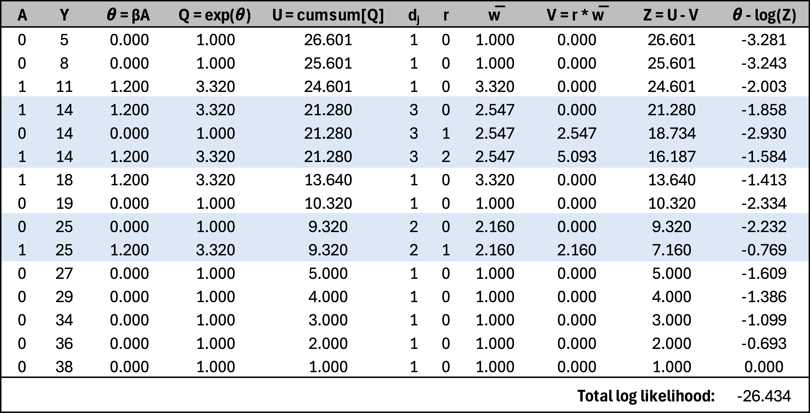

Over my past few posts, I’ve been progressively building towards a Bayesian model for a stepped-wedge cluster randomized trial with a time-to-event outcome, where time will be modeled using a spline function. I started with a simple Cox proportional hazards model for a traditional RCT, ignoring time as a factor. In the next post, I introduced a nonlinear time effect. For the third post—one I initially thought was ready to publish—I extended the model to a cluster randomized trial without explicitly incorporating time. I was then working on the grand finale, the full model, when I ran into an issue: I couldn’t recover the effect-size parameter used to generate the data.

After an embarrassingly long debugging process, I finally realized the problem—many events shared the same event times, and my model failed to account for ties. This issue hadn’t been apparent in the earlier models, but the final version was particularly sensitive to it. So, I decided to step back and first implement a model that properly handles ties before moving ahead.

### What's the issue?

The fundamental issue is that the likelihood in the original model assumes event times are unique for each individual. This assumption is reasonable when time is measured in hours but becomes problematic when using days and even more so with weeks, especially if the study covers a broad time range.

When multiple individuals experience an event at the same recorded time (ties), the challenge is defining the appropriate "risk set"—the group still at risk at that time. Two commonly used approaches for handling ties are the *Breslow* and *Efron* methods.

* The *Breslow* method takes a simple approach by assuming that all tied events share the same risk set. It treats them as if they happened sequentially but applies the same risk set to each event. This can work well when ties are rare but may introduce bias if they are frequent.

* The *Efron* method refines this by adjusting the risk set dynamically. Instead of treating all tied events as occurring with full risk sets, it reduces the risk set incrementally as each event happens. This better approximates a scenario where events truly occur in close succession rather than simultaneously.

In practical terms, the *Efron* method provides a more accurate correction when ties are common, while *Breslow* remains a computationally simpler choice. Another option is the Exact method, which calculates the likelihood by considering all possible orderings of tied events. While this approach is the most precise, it is often computationally impractical for large datasets. Much of this is described nicely in
[Hertz-Picciotto and Rockhill](https://www.jstor.org/stable/2533573){target="_blank"}, though the original methods are detailed by [Efron](https://www.tandfonline.com/doi/abs/10.1080/01621459.1977.10480613){target="_blank"} and 
[Breslow](https://www.jstor.org/stable/2529620){target="_blank"}. 
Finally, these [lecture notes](https://www.google.com/url?sa=t&source=web&rct=j&opi=89978449&url=https://myweb.uiowa.edu/pbreheny/7210/f15/notes/11-5.pdf){target="_blank"} by Patrick Breheny provide a nice explanation of algorithms for handling tied survival times.

### Implementing the Efron method

Since the *Efron* method generally provides better estimates, I chose to incorporate this into the Bayesian model. The partial likelihood under this approach is

$$
\log L(\beta) = \sum_{j=1}^{J} \left[ \sum_{i \in D_j} x_i^\top \beta - \sum_{r=0}^{d_j-1} \log \left( \sum_{k \in R_j} \exp(x_k^\top \beta) - r \cdot \bar{w} \right) \right] \\
$$

* $D_j$ is the set of individuals who experience an event at time $t_j$.
* $R_j$ is the risk set at time $t_j$, including all individuals who are still at risk at that time.
* $d_j$ is the number of events occurring at time $t_j$.
* $r$ ranges from 0 to $d_j - 1$, iterating over the tied events.
* $\bar{w}$ represents the average risk weight of individuals experiencing an event at $t_j$:

$$\bar{w} = \frac{1}{d_j} \sum_{i \in D_j} \exp(x_i^\top \beta)$$
 
The key idea here is that instead of treating all tied events as occurring simultaneously with the full risk set (as in Breslow’s method), *Efron* gradually reduces the risk set as each tied event is considered. This provides a more refined approximation of the true likelihood, particularly when ties are common.

In case a simple numerical example is helpful, here is a toy example of 15 individuals, where three share a common event time of 14 days (shown as $Y$), and two share an event time of 25 days. The critical feature of the *Efron* correction is that $\bar{w}$ is computed by averaging $\text{exp}(\theta)$ across the group experiencing the event at a given time. 

Initially, the cumulative sum of $\text{exp}(\theta)$ for each individual in the group is identical. However, as each event in the tied group is processed sequentially, the risk set is dynamically updated, and the contribution from individuals who have already been accounted for is gradually reduced. This is reflected in the term $Z = U-V$, where $U$ represents the initial total risk weight and $V$ accounts for the incremental reduction as ties are processed.

```{r, echo=FALSE, out.width="90%"}

```

<br>

### Simulating data

To generate data for testing the Bayesian model, I am simulating an RCT with 1,000 individuals randomized 1:1 to one of two groups (represented by $A$). The treatment effect is defined by the hazard ratio $\delta_f$. The data includes censoring and ties. 

We start with loading the necessary libraries:

```{r, message=FALSE}
library(simstudy)
library(data.table)
library(survival)
library(survminer)
library(cmdstanr)
```

Here is the simulation - definitions, parameters, and the data generation. 

```{r}
#### Data definitions

def <- defData(varname = "A", formula = "1;1", dist = "trtAssign")

defS <-
  defSurv(
    varname = "timeEvent",
    formula = "-11.6 + ..delta_f * A",
    shape = 0.30
  )  |>
  defSurv(varname = "censorTime", formula = -11.3, shape = .35)

#### Parameters

delta_f <- log(1.5)

#### Generate single data set

set.seed(7398)

dd <- genData(1000, def)
dd <- genSurv(dd, defS, timeName = "Y", censorName = "censorTime", digits = 0,
              eventName = "event", typeName = "eventType", keepEvents  = TRUE)

```

The Kaplan-Meier plot shows the two arms - red is intervention, and green is control, and the black crosses are the censoring times.

```{r km_plot, echo=FALSE, fig.width = 6, fig.height = 4}
library(ggplot2)

dd_surv <- survfit(Surv(Y, event) ~ A, data = dd)
dd_surv_tidy <- data.table(surv_summary(dd_surv, data = dd))
dd_censor <- dd_surv_tidy[n.censor > 0, ]

ggplot(dd_surv_tidy, aes(time, surv, color = factor(A))) +
  geom_step() +  # Kaplan-Meier curves
  geom_point(data = dd_censor, aes(time, surv), shape = 3, size = 1, color = "black")  +
  labs(x = "Time to event", y = "Probability of no event") +
  scale_color_manual(values = c("#cbce95", "#ce9995")) +
  theme(panel.grid = element_blank(), legend.position = "none") 

```

Of the 48 unique event times, 44 are shared by multiple individuals. This histogram shows the number of events at each time point:

```{r tied_plot, fig.height=4, fig.width=6, echo=FALSE}
dhist <- dd[, .N, keyby = Y]
ggplot(data = dhist, aes(x = Y, y = N)) +
  geom_col(fill = "#95aece") +
  xlab("event times") +
  ylab("number of events") +
  theme(panel.grid = element_blank())
  
```

### Stan model

The Stan code below extends the model to analyze survival data that I presented [earlier](https://www.rdatagen.net/post/2025-02-11-estimating-a-bayesian-proportional-hazards-model/){target="_blank"}, so much of the model remains the same. I've removed the binary search function that appeared in the earlier model, replacing it with an index field that is passed from `R`. There are additional data requirements that must also be sent from `R` to provide information about the ties. The model does not have additional parameters. The adjustment of the likelihood for the ties takes place in the "model" block.

This Stan code extends the survival model I described [earlier](https://www.rdatagen.net/post/2025-02-11-estimating-a-bayesian-proportional-hazards-model/){target="_blank"}, with much of the structure remaining unchanged. The binary search function from the previous model has been removed and replaced with an index field passed from `R`. New data fields related to ties are also required, which must be calculated in `R` and provided to the model. There are no additional parameters, and the likelihood adjustment for ties is handled in the "model" block.

```{r}
stan_code <-
"
data {

  int<lower=0> N_o;        // Number of uncensored observations
  array[N_o] int i_o;      // Index in data set

  int<lower=0> N;          // Number of total observations
  vector[N] x;             // Covariates for all observations
  
  array[N] int index;
  
  int<lower=0> T;            // Number of records as ties
  int<lower=1> G;            // Number of groups of ties
  array[T] int t_grp;        // Indicating tie group
  array[T] int t_index;      // Index in data set
  vector[T] t_adj;           // Adjustment for ties (efron)
}

parameters {
  
  real beta;          // Fixed effects for covariates

}

model {
  
  // Prior
  
  beta ~ normal(0, 4);
  
  // Calculate theta for each observation to be used in likelihood
  
  vector[N] theta;
  vector[N] log_sum_exp_theta;
  vector[G] exp_theta_grp = rep_vector(0, G);
  
  int first_in_grp;
  
  for (i in 1:N) {
    theta[i] = x[i] * beta;  
  }

  // Computing cumulative sum of log(exp(theta)) from last to first observation
  
  log_sum_exp_theta[N] = theta[N];
  
  for (i in tail(sort_indices_desc(index), N-1)) {
    log_sum_exp_theta[i] = log_sum_exp(theta[i], log_sum_exp_theta[i + 1]);
  }
  
  // Efron algorithm - adjusting cumulative sum for ties
  
  for (i in 1:T) {
    exp_theta_grp[t_grp[i]] += exp(theta[t_index[i]]);
  }

  for (i in 1:T) {
  
    if (t_adj[i] == 0) {
      first_in_grp = t_index[i];
    }

    log_sum_exp_theta[t_index[i]] =
      log( exp(log_sum_exp_theta[first_in_grp]) - t_adj[i] * exp_theta_grp[t_grp[i]]);
  }
  
  // Likelihood for uncensored observations

  for (n_o in 1:N_o) {
    target += theta[i_o[n_o]] - log_sum_exp_theta[i_o[n_o]];
  }
  
}

generated quantities {
  real exp_beta = exp(beta);
}
"
```

#### Compiling the model

```{r}
stan_model <- cmdstan_model(write_stan_file(stan_code))
```

#### Preparing the data for Stan

```{r, results="hide", message=FALSE, warning=FALSE}
dx <- copy(dd)
setorder(dx, Y)
dx[, index := .I]

dx.obs <- dx[event == 1]
N_obs <- dx.obs[, .N]
i_obs <- dx.obs[, index]

N_all <- dx[, .N]
x_all <- dx[, A]

ties <- dx[, .N, keyby = Y][N>1, .(grp = .I, Y)]
ties <- merge(ties, dx, by = "Y")
ties <- ties[, order := 1:.N, keyby = grp][, .(grp, index)]
ties[, adj := 0:(.N-1)/.N, keyby = grp]

stan_data <- list(
  N_o = N_obs,
  i_o = i_obs,
  N = N_all,
  x = x_all,
  index = dx$index,
  T = nrow(ties),
  G = max(ties$grp),
  t_grp = ties$grp,
  t_index = ties$index,
  t_adj = ties$adj
)
```

#### Fitting models

First, I am estimating the Bayesian model. To save time, I'm using `$optimize()` to obtain the MLE for `beta` from the Stan model rather than using MCMC to sample the full posterior distribution. The estimated hazard ratio is right on target:

```{r, results="hide", message=FALSE, warning=FALSE}
fit_mle <- stan_model$optimize(data=stan_data, jacobian = FALSE)
fit_mle$draws(format="df")[1,c("beta", "exp_beta")]
```

```{r echo=FALSE,message=FALSE, warning=FALSE}
fit_mle$draws(format="df")[1,c("beta", "exp_beta")]
```

For comparison, I fit a Cox proportional hazards model using a frequentist (non-Bayesian) approach. The log hazard ratio estimate matches that of the Bayesian model.

```{r}
cox_model <- coxph(Surv(Y, event) ~ A , data = dd, ties = "efron")
```

```{r, echo=FALSE}
broom::tidy(cox_model)
```

Of course, I really should conduct more extensive simulations to better understand the operating characteristics of the Bayesian model, particularly to assess how estimates behave when the ties are ignored. However, I'm eager to get back to the original program, moving next to a random effects model, and then completing the full model by combining the random effect with the spline. I'll leave these additional simulations for you to explore.

<p><small><font color="darkkhaki">
References:

Breslow, N., 1974. Covariance analysis of censored survival data. Biometrics, pp.89-99.

Efron, B., 1977. The efficiency of Cox's likelihood function for censored data. Journal of the American statistical Association, 72(359), pp.557-565.

Hertz-Picciotto, I. and Rockhill, B., 1997. Validity and efficiency of approximation methods for tied survival times in Cox regression. Biometrics, pp.1151-1156.

</font></small></p>