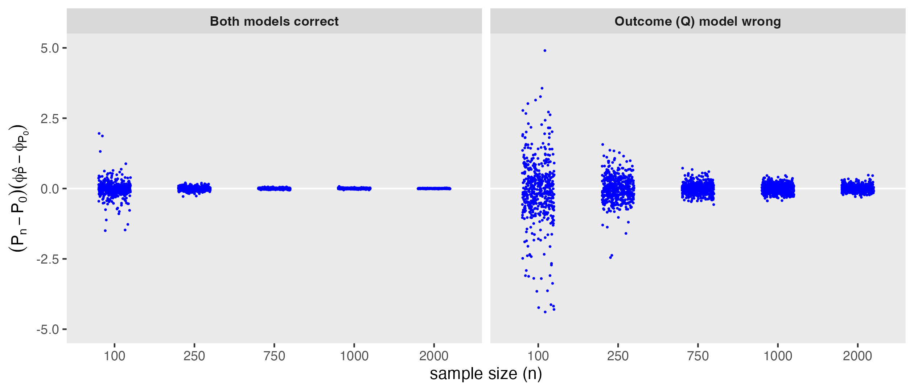

In the [previous post](https://www.rdatagen.net/post/2026-02-05-getting-to-the-bottom-of-tmle-1/){target="_blank"}, I argued that understanding TMLE starts with understanding how estimation error behaves. In the spirit of working through the conceptual issues underlying TMLE, I am adding what is really more of an addendum to that first post, as I developed a simulation that demonstrates one of the key orthogonal properties that makes TMLE work.

<!--more-->

### A key theoretical underpinning — a quick recap

In these analyses, we care about some target parameter $T(P_0)$, but in practice can observe data drawn from that distribution and can compute $T(P_n)$. The quantity that really matters is the difference
$$
T\big(P_n\big) − T\big(P_0\big),
$$
because that difference determines bias, variance, and uncertainty. Using the influence function, this error can be approximated as 
$$
T\big(P_n\big) − T\big(P_0\big) \approx \big(P_n − P_0\big) \phi_{P_0}.
$$
This is powerful because the right-hand side has well-understood statistical behavior. Unfortunately, we never observe the true influence function $\phi_{P_0}$. In causal problems, the influence function depends on nuisance components, outcome regressions and treatment mechanisms that must be estimated from data. So in practice, we replace the true influence function with an estimated $\phi_{\hat{P}}$, and the key quantity becomes
$$
\big(P_n−P_0\big) \phi_{\hat{P}}.
$$
This can be decomposed as 
$$
\big(P_n−P_0\big) \phi_{\hat{P}} = \big(P_n − P_0\big)  \phi_{P_0} + \big( P_n − P_0 \big) \big( \phi_{\hat{P}} − \phi_{P_0} \big)
$$
The first term is the “good” stochastic fluctuation we understand, but the second term is the dangerous one. It captures how errors in the nuisance models might leak into the leading behavior of the estimator. If this term does not vanish, then flexible nuisance estimation could distort the target parameter itself. However, when the influence function is constructed properly (and I think this is a key theoretical foundation behind TMLE), this leakage term shrinks toward zero as the sample size grows:
$$
\big( P_n − P_0 \big) \big( \phi_{\hat{P}} − \phi_{P_0} \big) \rightarrow 0
$$
I really wanted to see if we can observe that, at east in an artificial setting of simulated data. In particular, I wanted to see if this nuisance-driven term actually disappears as the sample size increases, even when the nuisance models are misspecified.

### A concrete example: the ATE influence function

To make this discussion less abstract, we need a concrete influence function. Suppose our target parameter is the average treatment effect (ATE):
$$\psi_0 = E_{P_0}\big[ Y_1 − Y_0 \big].$$
Under the usual identification conditions (consistency, exchangeability, and positivity), this can be written as a functional of the observed data distribution.

The efficient influence function for the ATE is:
$$\phi_{P_0} \big( Z \big ) = \big (Q_1 (X) − Q_0(X) − \psi_0 \big) + \frac{A}{g(X)} \big( Y − Q_1(X)\big) − \frac{1−A}{1−g(X)} \big( Y − Q_0(X) \big),$$
where the nuisance functions for the outcome ($Q$) and propensity score ($g$), respectively, are
$$
Q_a(X)=E[Y∣A=a,X], \ \ \ \ \ \ g(X)=P(A=1∣X).
$$
I won't go into the derivation of this influence function here (and maybe not anywhere, since there are many other sources far more qualified than me) but the structure is important. The nuisance functions appear in two distinct roles: directly through the plug-in term 
$Q_1(X)−Q_0(X)$, and indirectly through residual-based corrections such as $Y−Q_a(X)$, with the propensity score entering through weights. This layered form means that errors in the nuisance models do not affect the influence function in a single direction, but instead enter through both plug-in and correction terms.

If we knew the true outcome model $Q_a(X)$ and the true treatment mechanism $g(X)$, we would know the true influence function $\phi_{P_0}$. But in practice, we must estimate them, producing an estimated influence function $\phi_{\hat{P}}$. So for the ATE, the “dangerous term” $(P_n−P_0)(\phi_{\hat{P}} − \phi_{P_0})$ is driven entirely by how errors in estimating 
$Q$ and $g$ propagate through this expression.

In other words, misspecifying either the outcome model or the treatment model changes the influence function itself. If orthogonality were not present, these changes could enter the leading behavior of the estimator. Theory suggests that, for this influence function, their impact should diminish with increasing sample size.

Even when $Q$ and $g$ are estimated imperfectly, the interaction $(P_n−P_0)(\phi_{\hat{P}} − \phi_{P_0})$ should shrink toward zero. The simulation below is built around this specific influence function. We will deliberately estimate $Q$ and $g$ correctly or incorrectly, construct an estimated EIF, and observe whether this nuisance-driven term vanishes as the sample size grows.

### A note on cross-fitting

Before getting to the simulation, I want to point out why I use cross-fitting to estimate the nuisance parameters. While not strictly required for TMLE, it is generally good practice, especially when using flexible models. The quantity we want to examine, $(P_n−P_0)(\phi_{\hat{P}} − \phi_{P_0})$, captures how nuisance estimation error interacts with sampling variability.

Without cross-fitting, both the empirical fluctuation $(P_n − P_0)$ and the nuisance-driven error $\phi_{\hat{P}} − \phi_{P_0}$ are functions of the same data and therefore share the same randomness. Cross-fitting separates these sources of variation, reducing the feedback between nuisance estimation and empirical fluctuation, and allowing their interaction to better reflect the theoretical quantity of interest.

### Simulating the vanishing term

Before we get to the key functions, we need to load the two libraries:

```{r setup, include=FALSE}
knitr::opts_chunk$set(
  eval = FALSE
)
```

```{r simulation}
library(simstudy)
library(data.table)
```

#### Data-generating process

First, we define a simple data-generating process. This creates covariates ($X_1$ and $X_2$), treatment assignment ($A$) driven by those covariates, and an outcome $Y$ that depends on treatment, covariates, and their interaction. The parameter $\tau$ determines the true treatment effect.

```{r}
gen_dgp <- function(n) {
  
  def <- 
    defData(varname = "x1", formula = .5, dist = "binary") |>
    defData(varname = "x2", formula = 0, variance = 1) |>
    defData(
      varname = "a", 
      formula = "-0.2 + 0.8 * x1 + 0.6 * x2", 
      dist = "binary", 
      link = "logit"
    ) |>
    defData(
      varname = "y", 
      formula = "..tau * a + 1.0 * x1 + 1.0 * x2 + 1.5 * x1 * x2",
      variance = 1,
      dist = "normal"
    )
  
  genData(n, def)[]
  
}
```

#### Fitting nuisance models

Next, we create a helper function that fits the nuisance models — the outcome regression $Q$ and the propensity score $g$.

Depending on the scenario, these models are either correctly specified or deliberately misspecified. This allows us to examine whether the vanishing term behaves differently when nuisance models are wrong.

```{r}
fit_nuisance <- function(dt, scenario) {
  
  # Outcome regression Q(a,x)
  
  if (scenario %in% c("both_correct", "g_wrong")) {
    Q_fit <- lm(y ~ a + x1 + x2 + x1:x2, data = dt)  # correct
  } else {
    Q_fit <- lm(y ~ a + x1, data = dt)               # wrong on purpose
  }
  
  # Propensity model g(x)
  
  if (scenario %in% c("both_correct", "Q_wrong")) {
    g_fit <- glm(a ~ x1 + x2, data = dt, family = binomial())  # correct
  } else {
    g_fit <- glm(a ~ x1, data = dt, family = binomial())       # wrong on purpose
  }
  
  list(Q_fit = Q_fit, g_fit = g_fit)
}
```

#### Predictions and true nuisance functions

These functions generate predicted values from the fitted nuisance models, as well as the true outcome regression and propensity score implied by the data-generating process.

The predicted versions reflect estimation error; the true versions give us the benchmark influence function we would have if the nuisances were known.

```{r}
predict_Q <- function(Q_fit, dt, a_val) {
  nd <- copy(dt)
  nd[, a := a_val]
  as.numeric(predict(Q_fit, newdata = nd))
}

predict_g <- function(g_fit, dt) {
  p <- as.numeric(predict(g_fit, newdata = dt, type = "response"))
  pmin(pmax(p, 0.01), 0.99)  # simple stabilization
}

Q_true <- function(dt, a_val, tau) {
  tau * a_val + 1.0 * dt$x1 + 1.0 * dt$x2 + 1.5 * dt$x1 * dt$x2
}

g_true <- function(dt) {
  plogis(-0.2 + 0.8 * dt$x1 + 0.6 * dt$x2)
}
```

#### Constructing the influence function

Using the EIF expression for the ATE defined above, we can construct two versions:

- an estimated influence function based on fitted nuisance models
- the true influence function based on the known data-generating process

One small technical detail arises here. The EIF includes the target parameter $\psi_0$, and by definition it is centered — its mean should be zero under the relevant distribution. When we construct an estimated EIF, we therefore need to plug in a compatible estimate $\hat{\psi}$.

In this simulation, $\hat{\psi}$ is not the object of interest. Instead, it serves only to center the estimated influence function so that it behaves like a true influence function. To do this, we compute a fold-specific $\hat{\psi}$ using the same fitted nuisance models that are used to build the estimated EIF.

In principle, we could center the EIF using a simple plug-in estimate such as the average of 
$Q_1(X)−Q_0(X)$. Instead, we use an adjusted version that also includes a residual-based correction involving $\hat{Q}$ and $\hat{g}$. This choice ensures that the estimated EIF has approximately mean zero in the evaluation fold, making it behave more like the true influence function constructed from the same nuisance fits.

This allows us to compare the estimated influence function based on $\hat{Q}$ and $\hat{g}$, and the true influence function based on the known data-generating process, and ultimately evaluate how nuisance estimation error propagates through the EIF.

```{r}
psi_hat_from_fits <- function(dt, Q_fit, g_fit) {
  Q1 <- predict_Q(Q_fit, dt, 1)
  Q0 <- predict_Q(Q_fit, dt, 0)
  g  <- predict_g(g_fit, dt)
  A <- dt$a; Y <- dt$y
  mean((Q1 - Q0) + A/g * (Y - Q1) - (1 - A)/(1 - g) * (Y - Q0))
}

phi_ate <- function(dt, Q1, Q0, g, psi) {
  A <- dt$a
  Y <- dt$y
  (Q1 - Q0 - psi) + A/g * (Y - Q1) - (1 - A)/(1 - g) * (Y - Q0)
}

# Build phi_hat using your fitted nuisances (AIPW-style)

phi_hat_from_fits <- function(dt, Q_fit, g_fit, psi_hat) {
  Q1 <- predict_Q(Q_fit, dt, 1)
  Q0 <- predict_Q(Q_fit, dt, 0)
  g  <- predict_g(g_fit, dt)
  phi_ate(dt, Q1, Q0, g, psi_hat)
}

# Build phi0 from true nuisances

phi0_true <- function(dt, tau) {
  Q1 <- Q_true(dt, 1, tau)
  Q0 <- Q_true(dt, 0, tau)
  g  <- g_true(dt)
  psi0 <- tau
  phi_ate(dt, Q1, Q0, g, psi0)
}
```

#### Estimating the vanishing term

This function performs the core task of the simulation. For a given data set:

- we split the data into two folds
- fit nuisance models on each fold
- compute a cross-fitted EIF

We then compare the estimated EIF with the true EIF both in the sample and in an independent population draw (which is fixed across iterations). This allows us to approximate the nuisance-driven interaction term whose behavior we want to study.

```{r}
est_2T <- function(scenario, dd, tau, dd_pop) {
  
  n <- nrow(dd)
  idx <- sample.int(n)
  I1 <- idx[1:floor(n/2)]
  I2 <- idx[(floor(n/2)+1):n]
  
  # fit nuisances on each training fold
  
  fits1 <- fit_nuisance(dd[I1], scenario)  # trained on fold 1
  fits2 <- fit_nuisance(dd[I2], scenario)  # trained on fold 2
  
  # cross-fitted psi_hat (evaluate each model on opposite fold, then average)
  
  psi1 <- psi_hat_from_fits(dd[I2], fits1$Q_fit, fits1$g_fit)  # train 1, eval 2
  psi2 <- psi_hat_from_fits(dd[I1], fits2$Q_fit, fits2$g_fit)  # train 2, eval 1
  psi_hat_cf <- 0.5 * (psi1 + psi2)
  
  # cross-fitted phi_hat on dd:
  # - for obs in fold 2, use fits1 (trained on fold 1)
  # - for obs in fold 1, use fits2 (trained on fold 2)
  
  phi_hat_dd <- numeric(n)
  phi_hat_dd[I2] <- phi_hat_from_fits(dd[I2], fits1$Q_fit, fits1$g_fit, psi_hat_cf)
  phi_hat_dd[I1] <- phi_hat_from_fits(dd[I1], fits2$Q_fit, fits2$g_fit, psi_hat_cf)
  
  dphi_dd <- phi_hat_dd - phi0_true(dd, tau)
  
  # approximate P0 expectation:
  # evaluate delta-phi under each fold-specific nuisance fit on independent pop,
  # then average them (since cross-fitting produces two fitted nuisance models)
  
  dphi_pop_1 <- 
    phi_hat_from_fits(
      pop_dd, fits1$Q_fit, fits1$g_fit, psi_hat_cf) - phi0_true(pop_dd, tau
    )
  
  dphi_pop_2 <- 
    phi_hat_from_fits(
      pop_dd, fits2$Q_fit, fits2$g_fit, psi_hat_cf) - phi0_true(pop_dd, tau
    )
  
  dphi_pop <- 0.5 * (dphi_pop_1 + dphi_pop_2)
  
  T2 <- mean(dphi_dd) - mean(dphi_pop)
  
  data.table(scenario, n, T2)[]
}
```

#### Running the simulation

Finally, we repeatedly generate data and apply the procedure across sample sizes and nuisance model scenarios to see whether this interaction term shrinks toward zero.

```{r}
run_sim <- function(n, tau, dd_pop, scenarios) {
  
  dd <- gen_dgp(n)
  rbindlist(lapply(
      scenarios, 
      function(s) est_2T(s, dd, tau, dd_pop)
    )
  )
}

set.seed(1)

tau <- 5
pop_dd <- gen_dgp(5e5)

n = rep(c(100, 250, 750, 1000), each = 500)
scenarios = c("both_correct", "Q_wrong")

res <- rbindlist(
  lapply(n, function(x) run_sim(x, tau, dd_pop, scenarios))
)
```

### Results

Each point in the figure represents one estimate of the interaction term $(P_n−P_0)(\phi_{\hat{P}} − \phi_{P_0})$ from a single simulated data set, across sample sizes and nuisance model scenarios.

When both nuisance models are correctly specified, the estimates are tightly centered around zero even at smaller sample sizes. At $n = 100$, there is noticeable variability, but this rapidly diminishes as the sample size increases. By $n=750$ and $n=1000$, the estimates are highly concentrated near zero, consistent with the expectation that this term should vanish.

More interesting is the case where the outcome model is misspecified. Here, variability remains substantially larger across all sample sizes — reflecting the fact that nuisance estimation error is present and does not disappear simply because the sample grows. However, the estimates remain centered around zero and the spread clearly decreases with increasing $n$.

Even when nuisance models are imperfect, their contribution does not enter at first order. Instead, the interaction term shrinks with sample size, behaving like a second-order quantity. In other words, misspecification increases noise, but does not induce systematic drift.



For example, when both models are correct, the standard deviation drops from 0.28 at $n=100$ to 0.006 at $n=2000$. When the outcome model is misspecified, variability is much higher initially (1.34 at $n=100$), but still shrinks markedly with increasing $n$, falling to 0.12 by $n=2000$.

Across all settings, the averages remain close to zero, reinforcing that nuisance error affects variability rather than introducing systematic drift in this interaction term.

### Next steps

In the next post, I will finally look more squarely at TMLE, specifically considering how the targeting step is designed to make the efficient influence function equation hold.

<p><small><font color="darkkhaki">
Reference:

Van der Laan, Mark J., and Sherri Rose. Targeted learning: causal inference for observational and experimental data. Vol. 4. New York: Springer, 2011.

</font></small></p>
