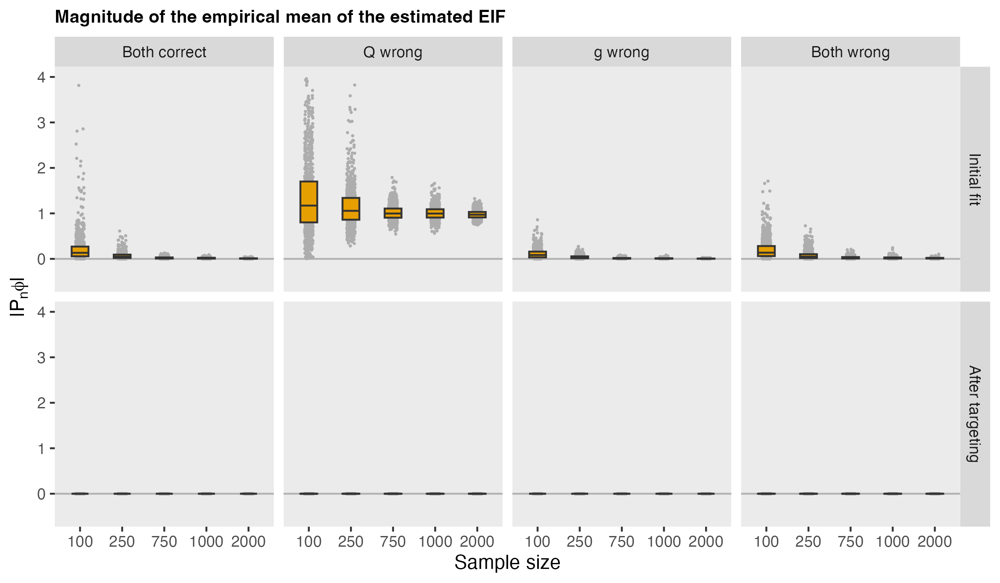
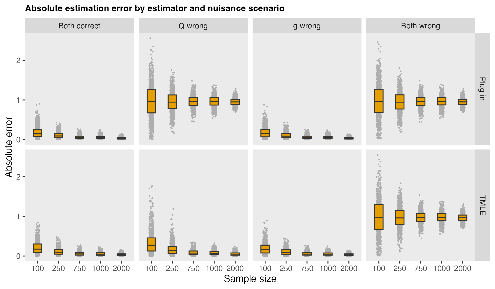

In the previous [post](https://www.rdatagen.net/post/2026-03-10-getting-to-the-bottom-of-tmle-2/){target="_blank"}, I worked my way through some key elements of TMLE theory as I try to understand how it all works. At its essence, TMLE is focused on getting the efficient influence function (EIF) to behave properly. When that happens, the estimator of the target parameter behaves as if it were based on a random sample from the true data-generating distribution.

Estimating the outcome and treatment (or exposure) models is an important part of constructing the EIF, but they are treated as nuisance components and do not need to be perfectly specified. The targeting step can adjust for errors in these nuisance estimates, often recovering the desired empirical behavior of the EIF and improving the resulting estimate of the target parameter, even when one of the nuisance models is misspecified.

<!--more-->

In that previous post, I described how TMLE does not simply try to improve the nuisance models, but instead makes a targeted adjustment so that the empirical mean of the estimated efficient influence function is brought back to zero. In this post, I use simulation to look directly at what targeting changes. In particular, I compare two estimators of the average treatment effect (ATE)---the plug-in estimator and TMLE---with the goal of understanding what the targeting step is doing mechanically and how it affects the final estimate.

I focus on two questions. First, how far is the empirical mean of the estimated influence function from zero before and after targeting? Second, how do the plug-in and TMLE estimates of the ATE behave across different nuisance-model scenarios? 

### A quick recap of the target

For a binary treatment $A$, covariates $X$, and outcome $Y$, define the conditional outcome regression and propensity score as
$$
Q_a(X)=E[Y∣A=a,X],\ \ \ g(X)=P(A=1∣X).
$$
Our target is the average treatment effect (represented as $\psi$):
$$
\psi_0 = E\big[Y(1)−Y(0)\big].
$$
Under the usual identification assumptions, this can be written as
$$
\psi(P)=E_P[Q_1(X)−Q_0(X)].
$$
The efficient influence function for the ATE is
$$
\phi_P(Z) = \big(Q_1(X)−Q_0(X)−\psi(P)\big ) + 
  \frac{A}{g(X)}\big(Y − Q_1(X)) −
  \frac{1−A}{1−g(X)}\big(Y−Q_0(X)\big).
$$
If we knew the true nuisance functions, this quantity would be centered under the true distribution, and its empirical mean would fluctuate around zero because of sampling variability. In practice, of course, we *plug in* estimated nuisance functions, and then the empirical mean need not be close to zero at all. TMLE updates the initial outcome regression just enough to remove that empirical imbalance.

The simulation below is designed to make that step visible.

### Data-generating process

To keep the story aligned with the previous simulation post, I use the same data-generating process. Covariates influence both treatment assignment and outcome, so there is genuine confounding. The true ATE is constant and equal to $\tau$.

```{r}
knitr::opts_chunk$set(
  eval = FALSE
)
```

```{r}
library(simstudy)
library(data.table)
library(ggplot2)
```

```{r}
gen_dgp <- function(n, tau = 5) {
  
  def <-
    defData(varname = "x1", formula = 0.5, dist = "binary") |>
    defData(varname = "x2", formula = 0, variance = 1, dist = "normal") |>
    defData(
      varname = "a",
      formula = "-0.2 + 0.8 * x1 + 0.6 * x2",
      dist = "binary",
      link = "logit"
    ) |>
    defData(
      varname = "y",
      formula = "..tau * a + 1.0 * x1 + 1.0 * x2 + 1.5 * x1 * x2",
      variance = 1,
      dist = "normal"
    )
  
  genData(n, def)[]
}
```

### Nuisance-model scenarios

To see how the estimators behave under different modeling assumptions, I consider four scenarios:

* both nuisance models correctly specified
* outcome model misspecified, propensity model correct
* propensity model misspecified, outcome model correct
* both nuisance models misspecified

The nuisance fitting functions vary under each scenario:

```{r}
fit_nuisance <- function(dt, scenario) {
  
  if (scenario %in% c("both_correct", "g_wrong")) {
    Q_fit <- lm(y ~ a + x1 + x2 + x1:x2, data = dt)
  } else {
    Q_fit <- lm(y ~ a + x1, data = dt)
  }
  
  if (scenario %in% c("both_correct", "Q_wrong")) {
    g_fit <- glm(a ~ x1 + x2, family = binomial(), data = dt)
  } else {
    g_fit <- glm(a ~ x1, family = binomial(), data = dt)
  }
  
  list(Q_fit = Q_fit, g_fit = g_fit)
}
```

The helper functions for prediction are straightforward:
  
```{r}
predict_Q <- function(Q_fit, dt, a_val) {
  nd <- copy(dt)
  nd[, a := a_val]
  as.numeric(predict(Q_fit, newdata = nd))
}

predict_g <- function(g_fit, dt) {
  p <- as.numeric(predict(g_fit, newdata = dt, type = "response"))
  pmin(pmax(p, 0.01), 0.99)
}
```

### Estimators

Here is a quick recap of the estimators. The simplest estimator plugs the initial outcome regression directly into the identifying functional:
$$
\hat{\psi}^0 =\frac{1}{n}\sum_{i=1}^n \big( \hat{Q}_1^0(X_i) − \hat{Q}_0^0(X_i) \big).
$$
This estimator depends heavily on the quality of the outcome model.

TMLE begins from the same initial nuisance fits but then updates the outcome regression along a one-dimensional fluctuation model. For a continuous outcome, the update is
$$
\hat{Q}^{\epsilon}(A,X) = \hat{Q}^0(A,X) + \epsilon H_{\hat{g}}(A,X),
$$
where the clever covariate is
$$
H_{\hat{g}}(A,X) = \frac{A}{\hat{g}(X)} − \frac{1−A}{1−\hat{g}(X)}.
$$
The coefficient $\epsilon$ is chosen so that the empirical mean of the weighted residual is zero. After updating the regression, the TMLE estimate is the plug-in estimator based on the targeted regression:
$$
\hat{\psi}^* = \frac{1}{n} \sum_{i=1}^n \big( \hat{Q}_1^∗(X_i) − \hat{Q}_0^∗(X_i)\big).
$$

### Constructing the efficient influence function

This helper function builds the efficient influence function once the nuisance quantities and parameter estimate are available:

```{r}
phi_ate <- function(dt, Q1, Q0, g, psi) {
  A <- dt$a
  Y <- dt$y
  (Q1 - Q0 - psi) + A / g * (Y - Q1) - (1 - A) / (1 - g) * (Y - Q0)
}
```

### The targeting step

For the Gaussian outcome used here, the fluctuation step can be fit by ordinary least squares with an offset. This gives us both the updated regression and the empirical mean of the targeted influence function.

```{r}
tmle_update_gaussian <- function(dx, Q_fit, g_fit) {
  
  dt <- copy(dx)
  
  dt[, QAW := predict_Q(Q_fit, dt, dt$a)]
  dt[, Q1  := predict_Q(Q_fit, dt, 1)]
  dt[, Q0  := predict_Q(Q_fit, dt, 0)]
  dt[, g   := predict_g(g_fit, dt)]
  dt[, H   := a / g - (1 - a) / (1 - g)]
  
  # Estimate fluctuation parameter on this data set unless supplied

  fluc_fit <- lm(y ~ -1 + offset(QAW) + H, data = dt)
  eps <- coef(fluc_fit)[["H"]]
  
  # Targeted updates
    
  dt[, QAW_star := QAW + eps * H]
  dt[, Q1_star  := Q1 + eps / g]
  dt[, Q0_star  := Q0 - eps / (1 - g)]
  
  list(
    eps = eps,
    Q1 = dt$Q1,
    Q0 = dt$Q0,
    g = dt$g,
    Q1_star = dt$Q1_star,
    Q0_star = dt$Q0_star
  )
}
```

### Simulation iterations

For each simulated data set and each nuisance modeling scenario, I keep track of:

* the absolute empirical mean of the estimated EIF for the plug-in fit
* the absolute empirical mean of the estimated EIF after targeting
* the absolute error of the plug-in estimate of the ATE
* the absolute error of the TMLE estimate of the ATE

Here is the function that does that using 2-fold cross-fitting:

```{r}
s_estimate <- function(dx, scenario, tau, n, nfolds = 2) {
  
  dt <- copy(dx)
  dt[, fold := sample(rep(1:nfolds, length.out = .N))]

  # Storage for fold-specific population diagnostics
  
  eps_vec <- numeric(nfolds)
  
  for (k in 1:nfolds) {
    
    train <- dt[fold != k]
    test  <- copy(dt[fold == k])
    
    fits <- fit_nuisance(train, scenario)
    
    # Sample: fit on train, target/evaluate on held-out test fold
    
    tmle_k <- tmle_update_gaussian(test, fits$Q_fit, fits$g_fit)
    eps_vec[k] <- tmle_k$eps
    
    # Write held-out predictions back into main sample object
    
    dt[fold == k, `:=`(
      Q1 = tmle_k$Q1,
      Q0 = tmle_k$Q0,
      g = tmle_k$g,
      Q1_star = tmle_k$Q1_star,
      Q0_star = tmle_k$Q0_star
    )]
  }
  
  # Cross-fitted sample estimators
  
  psi_plugin <- mean(dt$Q1 - dt$Q0)
  psi_tmle   <- mean(dt$Q1_star - dt$Q0_star)
  
  pn_phi_plugin <- mean(
    phi_ate(
      dt,
      Q1 = dt$Q1,
      Q0 = dt$Q0,
      g  = dt$g,
      psi = psi_plugin
    )
  )
  
  pn_phi_tmle <- mean(
    phi_ate(
      dt,
      Q1 = dt$Q1_star,
      Q0 = dt$Q0_star,
      g  = dt$g,
      psi = psi_tmle
    )
  )
  
  data.table(
    tau = tau,
    n = n,
    scenario = scenario,
    psi_true = tau,
    psi_plugin = psi_plugin,
    psi_tmle = psi_tmle,
    abs_pn_phi_plugin = abs(pn_phi_plugin),
    abs_pn_phi_tmle = abs(pn_phi_tmle),
    abs_err_plugin = abs(psi_plugin - tau),
    abs_err_tmle = abs(psi_tmle - tau),
    eps = mean(eps_vec)
  )
}
```

For each generated data set (based on a specific sample size), I fit four models, one for each set of nuisance model specification scenarios:

```{r}
s_simulate <- function(n, tau, scenarios) {
  
  dd <- gen_dgp(n, tau)
  rbindlist(lapply(scenarios, function(s) s_estimate(dd, s, tau, n)))
  
}
```

### Running the simulations

I create 1000 data sets for each possible sample size ranging from 100 to 2000:

```{r}
set.seed(2026)

tau <- 5
ns = rep(c(100, 250, 750, 1000, 2000), each = 1000)
scenarios <- c("both_correct", "Q_wrong", "g_wrong", "both_wrong")

res <- rbindlist(
  lapply(ns, function(x) s_simulate(x, tau, scenarios))
)
```

### Empirical EIF mean before and after targeting

Below is a plot that shows the distribution of the absolute empirical mean of the EIF for each of the scenarios defined by sample size and nuisance parameter estimation both before and after targeting. There were 1000 data sets generated for each scenario:



Before targeting, the empirical mean of the estimated EIF is often noticeably away from zero, especially in smaller samples and under misspecification, particularly when the outcome model is misspecified. After targeting, that imbalance collapses to essentially zero in every scenario, because the fluctuation step is constructed to make that happen.

However, this balance is enforced in the sample, not necessarily in the population. In additional simulations (not shown here), I found that even after targeting, the population mean of the estimated EIF can remain nonzero when the nuisance models are misspecified. When that happens, the estimator remains biased (see below), consistent with the fact that estimation error is driven by the population mean of the EIF.

This corresponds to the second term described in the previous post: when the nuisance models are misspecified, the targeted influence function differs from the true one in the population, and that discrepancy shows up as bias in the estimator. In this sense, targeting and double robustness play complementary roles: targeting guarantees *sample balance* (i.e., $P_n \phi_{\hat{P}^*} = 0$), while double robustness helps ensure *population balance* (i.e., $P_0 \phi_{\hat{P}^*} \approx 0$) when at least one nuisance model is correctly specified.

### Estimator performance

The goal, of course, is not just to make an estimating equation look tidy. The real question is whether this changes the behavior of the parameter estimate itself.



When both nuisance models are correctly specified, both estimators behave well. However, when the outcome model is wrong but the propensity model is correct, the plug-in estimator struggles because it depends directly on the misspecified outcome regression. In contrast, the TMLE estimator remains much more stable because it uses the propensity-based residual correction. This is double robustness in action. When the propensity model is wrong but the outcome model is correct, the plug-in estimator still performs well, and TMLE also remains consistent. When both nuisance models are wrong, neither estimator behaves well, highlighting the fact that TMLE is not a panacea.

### Final thoughts

The earlier post argued that TMLE works by slightly adjusting the nuisance fit until the empirical influence-function equation is brought back into balance. This simulation makes that claim visible. Before targeting, the estimated EIF can be noticeably off center. After targeting, it is effectively zero by construction.

But this balance is enforced in the sample, not necessarily in the population. When the nuisance models are misspecified, the targeted influence function can still differ from the true one, and its population mean may remain nonzero. In those cases, the estimator remains biased, even though the empirical EIF equation is perfectly satisfied.

This highlights the central role of the influence function: targeting ensures that the estimator behaves like the ideal first-order expansion in the observed data, but its ultimate performance still depends on how well the estimated influence function reflects the true data-generating process.

The efficient influence function also plays a central role in inference, since its empirical variance is typically used to estimate the standard error of the TMLE. I have not focused on that aspect here, since the goal of these simulations was to understand how targeting affects bias and stability. When the EIF is well-behaved, it not only centers properly but also provides a natural way to quantify uncertainty. I hope to return to this idea in more applied settings down the road.

<p><small><font color="darkkhaki">
Reference

Van der Laan, Mark J., and Sherri Rose. Targeted learning: causal inference for observational and experimental data. Vol. 4. New York: Springer, 2011.

Support

This work was supported by the National Institute on Aging (NIA) of the National Institutes of Health under Award Number U54AG063546, which funds the NIA IMbedded Pragmatic Alzheimer’s Disease and AD-Related Dementias Clinical Trials Collaboratory (NIA IMPACT Collaboratory
). The author, a member of the Design and Statistics Core, was the sole writer of this blog post and has no conflicts. The content is solely the responsibility of the author and does not necessarily represent the official views of the National Institutes of Health.
</font></small></p>

