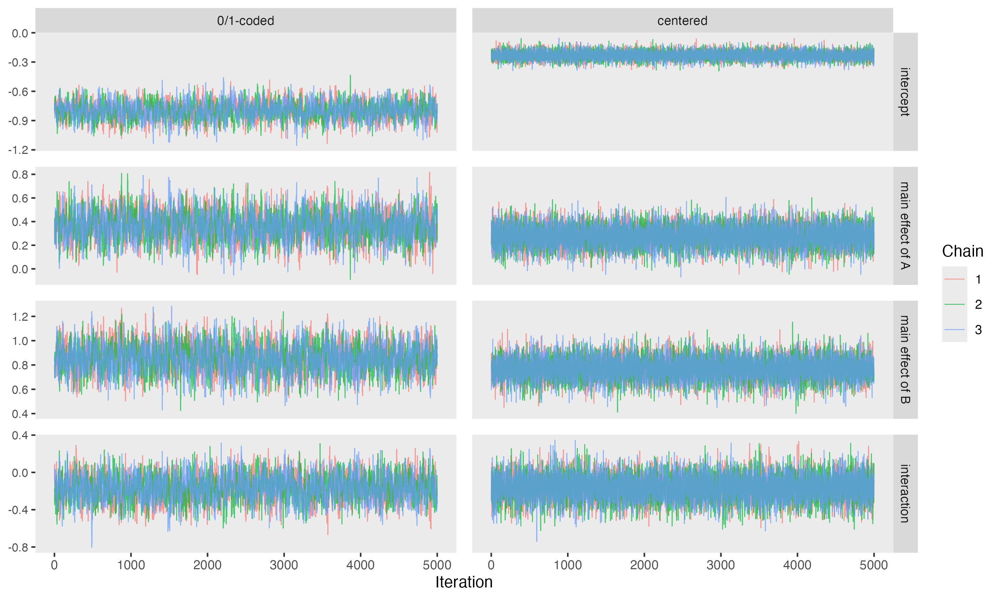
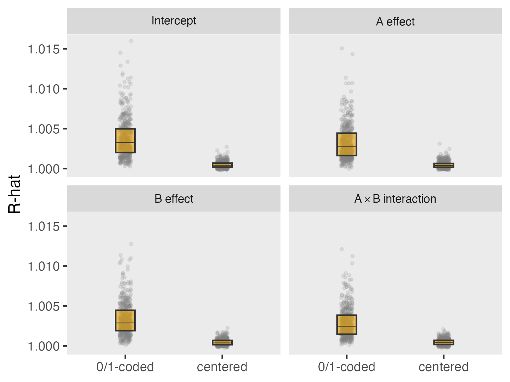
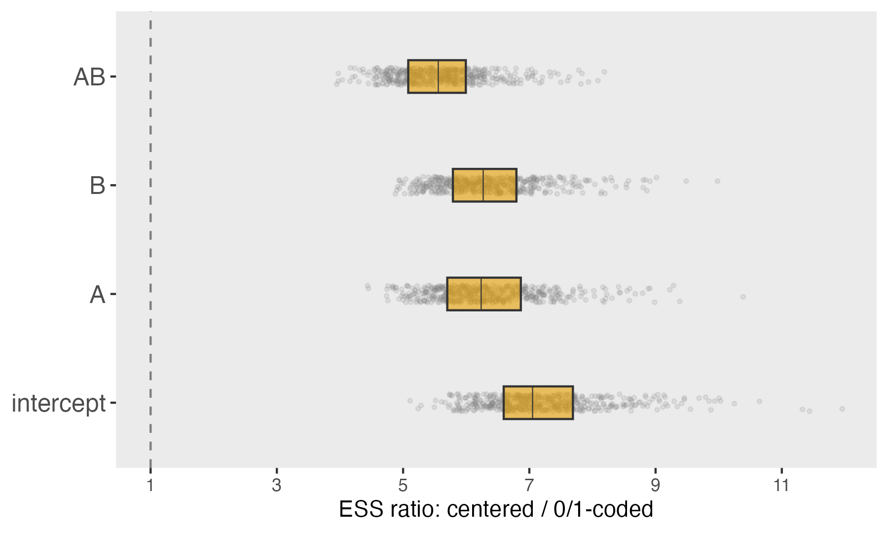
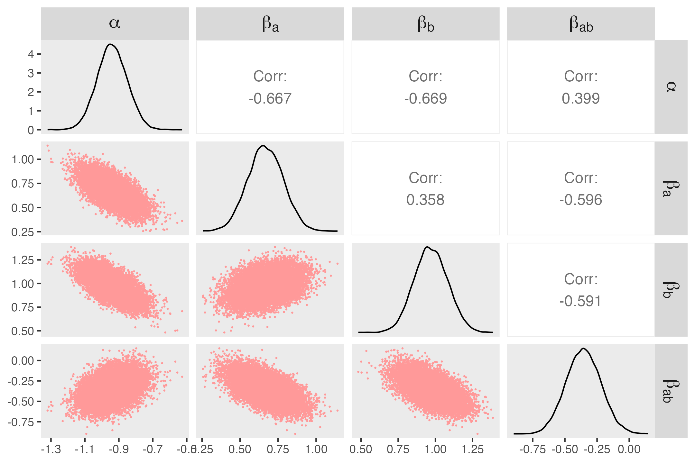
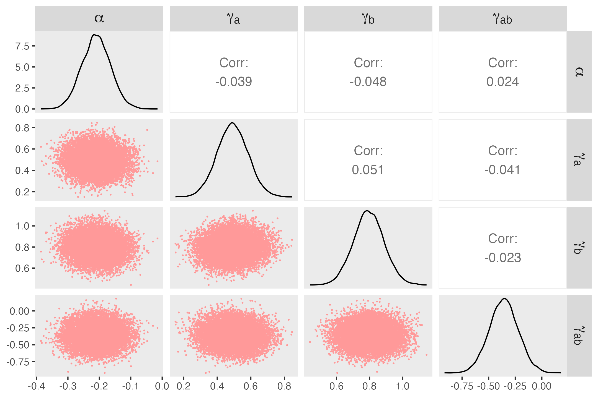

The *Emergency departments leading the transformation of Alzheimer’s and dementia care* (ED-LEAD) study, which I have written about in the [past](https://www.rdatagen.net/post/2024-02-20-ensuring-balance-with-a-cluster-randomized-factorial-design/){target="_blank"}, is approaching the end of its third year. This multifactorial design evaluates three independent, yet potentially synergistic, interventions aimed at improving care for persons living with dementia (PLWD) and their caregivers.

To estimate intervention effects, we are using what I’ve [called](https://onlinelibrary.wiley.com/doi/full/10.1002/sim.70264){target="_blank"} the *HEx-factor model*, a Bayesian hierarchical exchangeable factorial model. The original plan was to conduct all analyses using [`Stan`](https://mc-stan.org/){target="_blank"}. However, we’ve run into a bit of a snafu. Working through the issue led to a solution that is worth sharing.

The challenge turned out to be computational. Because the *ED-LEAD* analyses must be conducted within the NIA Data LINKAGE Enclave, we are working in a somewhat restricted software environment, at least with respect to Bayesian data analysis. In particular, we have not been able to install or run `Stan`, which was our original analytic engine. This forced us to consider alternatives, and we turned to `JAGS`, which is available in the Linkage environment and well-suited for Bayesian hierarchical modeling.

At first glance, this might seem like a straightforward substitution. Both `Stan` and `JAGS` allow us to specify the same likelihood and priors. However, I quickly noticed that the models were not performing as well in `JAGS` as they had in `Stan`. It turns out that the samplers used in `JAGS` are more sensitive to posterior dependence than the Hamiltonian Monte Carlo (HMC) methods implemented in `Stan`.

I set out to understand and fix the problem, and found that a simple reparameterization made a substantial difference. With this change, the `JAGS` sampler was able to explore the posterior distribution much more efficiently, yielding results comparable to those obtained with `Stan`.

To understand why this happens, I ran a series of simple simulations comparing the original and reparameterized versions of a basic two-way factorial model. That is what I present here.

### The setup

In models with binary predictors and interactions, centering can have a surprisingly large impact on computation, even though it does not change the underlying model. To see this clearly, I’ll start with a simple two-factor logistic model:
$$
\text{logit}\big[P(Y=1)\big] = \alpha+ \beta_a A + \beta_b B + \beta_{ab}AB 
$$
where $A$ and $B$ are binary treatment indicators. I’ll compare this to the algebraically equivalent centered version:
$$
\text{logit}\big[P(Y=1)\big] = \alpha^*+ \gamma_a A^* + \gamma_b B^* + \gamma_{ab}A^*B^* 
$$
where

$$
A^∗ = A − 0.5, \ \ \ B^∗ = B − 0.5.
$$

The scientific model is unchanged. The question is whether the sampler behaves differently.

### Creating a single data set

Before we get started, we need to load the necessary libraries:

```{r setup, message=FALSE, warning=FALSE}
library(simstudy)
library(data.table)
library(ggplot2)
library(rjags)
library(coda)
library(posterior)
library(broom)
library(gt)

RNGkind("Mersenne-Twister", "Inversion", "Rejection")
set.seed(824)
```

Here is the data generation process for a single data set. The outcome $Y$ is generated using the binary parameterization of $A$ and $B$:

```{r gen_data}
s_gen <- function(n = 2000,
                    alpha = -0.8,
                    beta_a = 0.5,
                    beta_b = 0.9,
                    beta_ab = -0.3) {
  
  def <- 
    defData(varname = "A", formula = 0.5, dist = "binary") |>
    defData(varname = "B", formula = 0.5, dist = "binary") |>
    defData(varname = "AB", formula = "A*B", dist = "nonrandom") |>
    defData(varname = "A_c", formula = "A - 0.5", dist = "nonrandom") |>
    defData(varname = "B_c", formula = "B - 0.5", dist = "nonrandom") |>
    defData(varname = "AB_c", formula = "A_c * B_c", dist = "nonrandom") |>
    defData(
      varname = "Y", 
      formula = "..alpha + ..beta_a * A + ..beta_b * B + ..beta_ab * AB",
      dist = "binary", link = "logit"
    )
    
  genData(n, def)
  
}

dd <- s_gen()
```

### The two parameterizations fit the same model

First, here is the frequentist check. The fitted probabilities are identical, even though the coefficients differ.

```{r simple_glm}
fit_01 <- glm(Y ~ A * B, data = dd, family = binomial)
fit_c  <- glm(Y ~ A_c * B_c, data = dd, family = binomial)

tidy(fit_01)
tidy(fit_c)
```

With 0/1 coding, the log-odds ratio for $A$ alone (that is, when $B=0$) is simply
$$
\begin{align*}
\text{lOR}_a(B=0) &= (\alpha + \beta_a \cdot 1 + \beta_b \cdot 0 + \beta_{ab} \cdot 0) -(\alpha + \beta_a \cdot 0 + \beta_b \cdot 0 + \beta_{ab} \cdot 0) \\
& = \beta_a
\end{align*}
$$
Analogously, the log-odds ratio for $B$ alone is $\beta_b$. And if we want to compare the combination of both $A=1$ and $B=1$ to the case where neither is activated, then
$$
\begin{align*}
\text{lOR}_{ab} &= (\alpha + \beta_a \cdot 1 + \beta_b \cdot 1 + \beta_{ab} \cdot 1) \\
&\quad -
(\alpha + \beta_a \cdot 0 + \beta_b \cdot 0 + \beta_{ab} \cdot 0) \\
&= \beta_a + \beta_b + \beta_{ab}
\end{align*}
$$
If instead we center the predictors, defining $A^* = A - 0.5$ and $B^* = B - 0.5$, then the log-odds ratio of exposure to $A$ without exposure to $B$ relative to exposure to neither is
$$
\begin{align*}
\text{lOR}_a(B=0)
&=
(\alpha^* + \gamma_a(0.5) + \gamma_b(-0.5) + \gamma_{ab}(0.5)(-0.5)) \\
&\quad -
(\alpha^* + \gamma_a(-0.5) + \gamma_b(-0.5) + \gamma_{ab}(-0.5)(-0.5)) \\
&=
(\alpha^* + 0.5\gamma_a - 0.5\gamma_b - 0.25\gamma_{ab}) \\
&\quad -
(\alpha^* - 0.5\gamma_a - 0.5\gamma_b + 0.25\gamma_{ab}) \\
&=
\gamma_a - 0.5\gamma_{ab}.
\end{align*}
$$
Using the same logic we can show that 
$$
\text{lOR}_{b} = \gamma_{b} - 0.5 \gamma_{ab}
$$ 
and 
$$
\text{lOR}_{ab} = \gamma_a + \gamma_b.
$$ 
<!-- $$ -->
<!-- \begin{align*} -->
<!-- \text{lOR}_{ab} &= (\alpha^* + \gamma_a(0.5) + \gamma_b(0.5) + \gamma_{ab}(0.5) (0.5)) -  (\alpha^* + \gamma_a(-0.5) + \gamma_b(-0.5) + \gamma_{ab}(-0.5)(-0.5))\\ -->
<!--  &= (\alpha^* + \gamma_a * 0.5 + \gamma_b * 0.5 + \gamma_{ab} * 0.25) -  (\alpha^* - \gamma_a * 0.5 - \gamma_b * 0.5 + \gamma_{ab} * 0.25)\\ -->
<!-- & = \gamma_a + \gamma_b -->
<!-- \end{align*} -->
<!-- $$ -->
From the 0/1-coded model, $\text{lOR}_a = 0.835$, $\text{lOR}_b = 1.14$, and $\text{lOR}_{ab} = 0.835 + 1.14 - 0.67 = 1.305.$

From the centered model, 
$$
\text{lOR}_a = 0.501 + 0.5*0.670 = 0.836
$$
$$
\text{lOR}_b = 0.802 + 0.5*0.670 = 1.137
$$
$$
\text{lOR}_{ab} = 0.501 + 0.802 = 1.303
$$
So the coefficients themselves change under centering, but the underlying treatment contrasts do not.

### Bayesian models using JAGS

The model we are fitting is a simple logistic regression with an interaction term:

$$
\begin{align*}
Y_i &\sim \text{Bernoulli}(p_i), \\
\text{logit}(p_i)
&= \alpha + \beta_a A_i + \beta_b B_i + \beta_{ab} A_i B_i,
\end{align*}
$$
Here are the prior distribution assumptions, using variance-based notation to align with JAGS, which parameterizes normal distributions in terms of precision
$$
\begin{align*}
\alpha &\sim \mathcal{N}(0, 0.25^{-1}), \\
\beta_a &\sim \mathcal{N}(0, 0.25^{-1}), \\
\beta_b &\sim \mathcal{N}(0, 0.25^{-1}), \\
\beta_{ab} &\sim \mathcal{N}(0, 25^{-1}).
\end{align*}
$$
The centered model is similar, except that we replace the coefficients with $\alpha^*$ as well as $\gamma_a$, $\gamma_b$, $\gamma_{ab}$, and define the predictors in terms of centered versions of $A$ and $B$. This reparameterization does not change the model itself, but it does change how the coefficients relate to the underlying treatment contrasts.

```{r}
model_01 <- "
model {
  for (i in 1:N) {
    Y[i] ~ dbern(p[i])
    logit(p[i]) <- alpha + beta_a * A[i] + beta_b * B[i] + beta_ab * AB[i]
  }
  
  alpha   ~ dnorm(0, 0.25)
  beta_a  ~ dnorm(0, 0.25)
  beta_b  ~ dnorm(0, 0.25)
  beta_ab ~ dnorm(0, 25)
}
"

model_c <- "
model {
  for (i in 1:N) {
    Y[i] ~ dbern(p[i])
    logit(p[i]) <- alpha + gamma_a * A_c[i] + gamma_b * B_c[i] + gamma_ab * AB_c[i]
  }
  
  alpha   ~ dnorm(0, 0.25)
  gamma_a  ~ dnorm(0, 0.25)
  gamma_b  ~ dnorm(0, 0.25)
  gamma_ab ~ dnorm(0, 25)
}
"
```

### Fit both models to one dataset

The function `fit_jags` fits one of the two models just described:

```{r fit_single_jags, eval=FALSE}
fit_jags <- function(dat, model_string, centered = FALSE,
                     n_chains = 3, burn = 2000, n_iter = 5000) {
  
  # jdat <- as.list(dat[, .(Y, A, B, AB, A_c, B_c, AB_c)])
  if (centered) {
    jdat <- as.list(dat[, .(Y, A_c, B_c, AB_c)])
    vars <- c("alpha", "gamma_a", "gamma_b", "gamma_ab")
  } else {
    jdat <- as.list(dat[, .(Y, A, B, AB)])
    vars <- c("alpha", "beta_a", "beta_b", "beta_ab")
  }
  jdat$N <- nrow(dat)
  
  mod <- jags.model(
    textConnection(model_string),
    data = jdat,
    n.chains = n_chains,
    quiet = TRUE
  )
  
  update(mod, burn, progress.bar = "none")
  
  samp <- coda.samples(
    mod,
    variable.names = vars,
    n.iter = n_iter,
    progress.bar = "none"
  )
  
  samp
}
```

Now, we can fit the models, collect the diagnostic data, and take a look at the results:

```{r get_diags, eval=FALSE}
samp_01 <- fit_jags(dd, model_01, centered = FALSE)
samp_c  <- fit_jags(dd, model_c, centered = TRUE)

diag_tbl <- function(samp, model_name) {
  post <- as_draws_df(samp)
  summ <- summarise_draws(post)
  out <- as.data.table(summ)
  out[, model := model_name]
  out[]
}

diag_01 <- diag_tbl(samp_01, "0/1-coded")
diag_c  <- diag_tbl(samp_c, "centered")
```

```{r, echo = FALSE}
load("code_and_data/ddiag.Rdata")

gt_tbl <- ddiag |>
  # group rows by `model` (this creates sections)
  gt(rowname_col = NULL, groupname_col = "model") |>
  # optional: nicer labels
  cols_label(
    variable = "Parameter",
    mean     = "Mean",
    median   = "Median",
    sd       = "SD",
    mad      = "MAD",
    q5       = "5th %tile",
    q95      = "95th %tile",
    rhat     = "R-hat",
    ess_bulk = "ESS (bulk)",
    ess_tail = "ESS (tail)"
  ) |>
  # smaller font
  tab_options(
    table.font.size = px(15)
  ) |>
  tab_style(
    style = cell_text(weight = "bold"),
    locations = cells_row_groups()   # all group titles
  )

gt_tbl
```

There are a few things to notice here. First, the Bayesian estimates for both the 0/1-coded and centered data are closer to zero than the GLM estimates above. The shrinkage is particularly large for the interaction term, because we placed much more restrictive priors on $\beta_{ab}$ and $\gamma_{ab}$. This is exactly what we would expect: the prior is pulling the interaction toward zero, and that influence shows up clearly in the posterior summaries.

Second, if we compare the two parameterizations, we see that the R-hat---essentially a measure of whether the chains have converged to the same distribution---is slightly lower for the centered data. There isn’t much to make of the difference here (both are very close to 1), but it does suggest slightly more stable behavior.

The biggest impact is on the bulk effective sample size (ESS), which reflects how much independent information the chains contain after accounting for autocorrelation. Even though we ran the same number of iterations, the centered model yields far larger ESS values, indicating much better mixing. In other words, the sampler is exploring the posterior much more efficiently under the centered parameterization, and in this case the improvement is quite dramatic. Importantly, these differences have nothing to do with the models themselves since the likelihood is unchanged. Rather it reflects how easy it is for the sampler to navigate the posterior surface when the data are centered.

A comparison of the trace plots reinforces the stability that centering the data provides. The traces for the 0/1-coded data are a bit more irregular, suggesting less efficient exploration of the posterior. In contrast, the centered parameterization produces tighter, more stable traces with less autocorrelation, indicating that the chains are mixing more effectively. This aligns with the much larger effective sample sizes observed for the centered model.



```{r get_lor, eval=FALSE}
get_lor_summary <- function(samp, model_name) {
  dt <- as.data.table(as_draws_df(samp))
  
  if (model_name == "0/1-coded") {
    dt[, lOR_A := beta_a]
    dt[, lOR_B := beta_b]
    dt[, lOR_AB := beta_a + beta_b + beta_ab]
  } else {
    dt[, lOR_A := gamma_a - 0.5 * gamma_ab]
    dt[, lOR_B := gamma_b - 0.5 * gamma_ab]
    dt[, lOR_AB := gamma_a + gamma_b]
  }
  
  dt[, .(
    mean_A = mean(lOR_A),
    mean_B = mean(lOR_B),
    mean_AB = mean(lOR_AB),
    sd_A = sd(lOR_A),
    sd_B = sd(lOR_B),
    sd_AB = sd(lOR_AB)
  )]
}

lor_01 <- get_lor_summary(samp_01, "0/1-coded")
lor_c  <- get_lor_summary(samp_c,  "centered")
```

```{r show_lors, echo= FALSE}
fmt_num <- function(x) sub("\\.?0+$", "", sprintf("%.3f", x))

bayes_lors[, `:=`(
  A  = sprintf("%s (%s)", fmt_num(mean_A), fmt_num(sd_A)),
  B  = sprintf("%s (%s)", fmt_num(mean_B), fmt_num(sd_B)),
  AB = sprintf("%s (%s)", fmt_num(mean_AB), fmt_num(sd_AB))
)]

gt(bayes_lors[, .(model, A, B, AB)]) |>
  cols_label(
    model = "",
    A = "log OR A",
    B = "log OR B",
    AB = "log OR AB"
  ) |>
  cols_align(align = "center", -model)
```

### A larger simulation experiment

A single data set can be misleading. So next I’ll repeat this 500 times and compare the two parameterizations across simulations. Each iteration, I generate a data set with 2000 observations, I fit each model---the one with 0/1-coding and the other with centered coding---using `JAGS`, and collecting summary data of the posteriors for each model generated by `JAGS`: mean, median, standard deviation, median absolute deviation, 5th percentile, 95th percentile, R-hat, bulk ESS, and tail ESS.

```{r sims, eval = FALSE}
one_run <- function(
  n = 2000,
  truth = c(alpha = -0.8, beta_a = 0.5, beta_b = 0.9, beta_ab = -0.3),
  n_chains = 3,
  burn = 1000,
  n_iter = 3000
) {
  
  dd <- s_gen(
    n = n,
    alpha = truth["alpha"],
    beta_a = truth["beta_a"],
    beta_b = truth["beta_b"],
    beta_ab = truth["beta_ab"]
  )
  
  samp_01 <- fit_jags(
    dd, model_01, centered = FALSE, 
    n_chains = n_chains, burn = burn, n_iter = n_iter, 
  )
  
  samp_c <- fit_jags(
    dd, model_c, centered = TRUE, 
    n_chains = n_chains, burn = burn, n_iter = n_iter)
  
  get_metrics <- function(samp, model_name) {
    post <- as_draws_df(samp)
    summ <- as.data.table(summarise_draws(post))
    summ[, model := model_name]
    summ[]
  }
  
  out <- rbindlist(list(
    get_metrics(samp_01, "0/1-coded"),
    get_metrics(samp_c,  "centered")
  ))
  
  out[]
}

nsim <- 500

sim_res <- rbindlist(mclapply(seq_len(nsim), function(i) {
  out <- one_run()
  out[, sim := i]
  out[]
}, mc.cores = 5))
```

Earlier we saw for a single data set, there was not much difference in R-hat (essentially a measure of whether the chains have converged to the same distribution) between the two models. However, over repeated data sets, a more interesting picture emerges. The figure below shows that while R-hat for the 0/1-coding model is quite low, R-hat for the centered-coding is lower still, and much more consistent, suggesting that mixing is stronger in the centered model.

```{r echo=FALSE, out.width="75%"}

```

The next figure confirms what we saw earlier. This shows the distribution of ratios of bulk ESS in the centered model compared to the 0/1-coding model. If the two models had the same effective sample size, we would expect those ratios to cluster near one. However, they are all mostly greater than five, confirming what we saw for the individual data set.

```{r echo=FALSE, out.width="75%"}

```

The key issue is posterior dependence among parameters: when parameters are highly correlated, the sampler must explore long, narrow regions in the posterior, which slows mixing.

### Understanding what is driving the performance

To better understand this, we can look directly at the dependence structure of the posterior draws. Correlation plots help explain what is driving these differences in performance. Under the 0/1-coded parameterization, the posterior exhibits strong dependence among parameters. Several pairs of coefficients show substantial correlations, reflecting the fact that different combinations of parameters can produce similar fitted values. In geometric terms, the joint posterior distribution has an elongated, highly correlated structure. This is evident in the pairwise scatter plots, where draws fall along narrow, tilted bands rather than forming roughly circular clouds.

```{r echo=FALSE, out.width="75%"}

```

This geometry makes life difficult for the sampler. Exploring such a narrow region requires many small, correlated steps, which leads to high autocorrelation and, ultimately, low effective sample sizes.

In contrast, the centered parameterization produces a posterior that is nearly uncorrelated. The coefficients capture more distinct aspects of the model, and the resulting posterior is much more spherical. This greatly simplifies the exploration of the parameter space, allowing the sampler to move more freely through the parameter space.

```{r echo=FALSE, out.width="75%"}

```

The key point is that centering does not change the model or the scientific conclusions. It changes the geometry of the posterior distribution, and that change can have a dramatic impact on computational performance. In effect, centering makes the parameters closer to orthogonal, reducing interference among them and improving both statistical and computational behavior.

In the ED-LEAD study, where we are fitting hierarchical factorial models with multiple intervention components, this shift in parameterization is critical. Centering the treatment indicators leads to more stable estimation and far more efficient sampling, which is particularly important given our reliance on `JAGS`. Unlike Hamiltonian Monte Carlo (as implemented in `Stan`), which can handle correlated posteriors more effectively, the Gibbs and Metropolis-based updates used by `JAGS` are much more sensitive to posterior dependence. Improving the geometry of the posterior is therefore essential for good performance in this setting.
